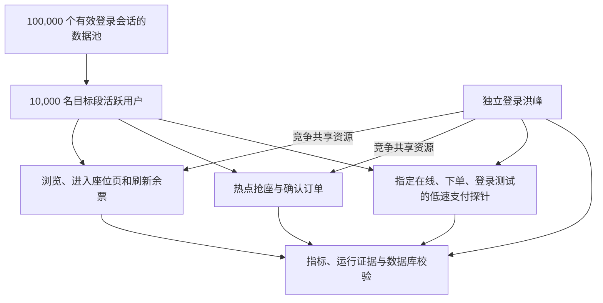
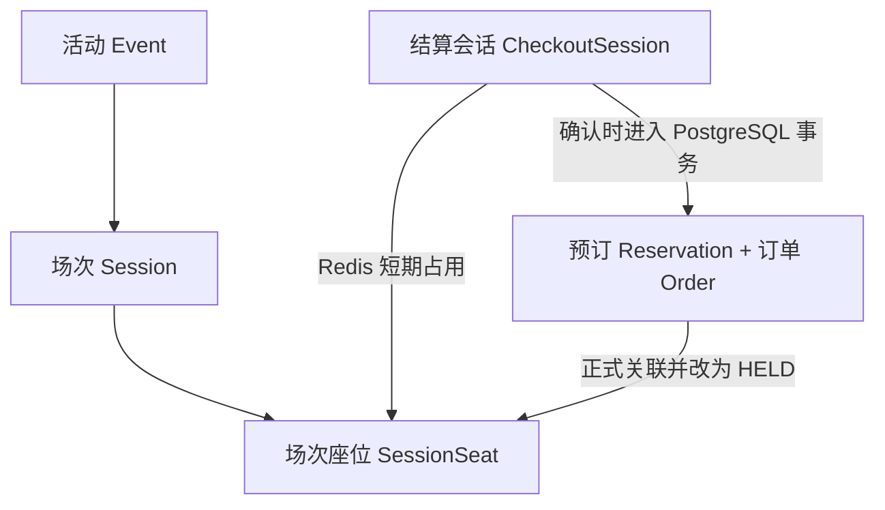
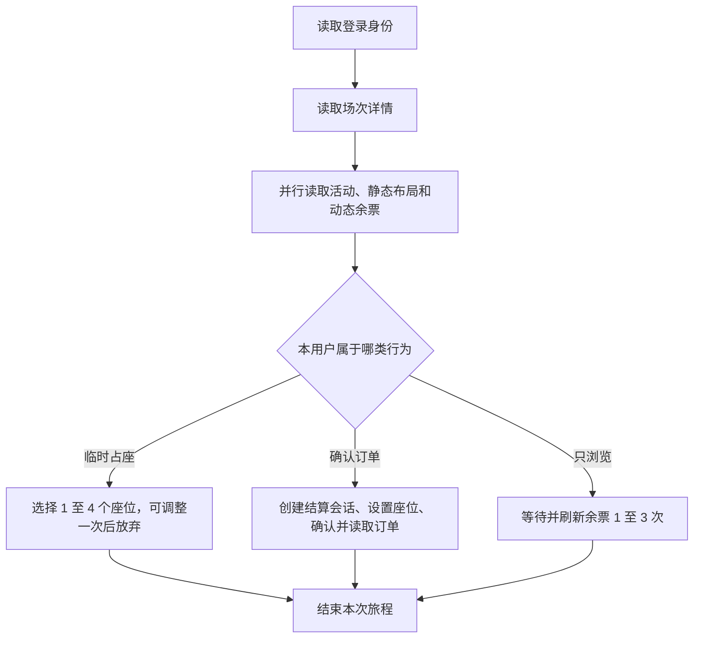
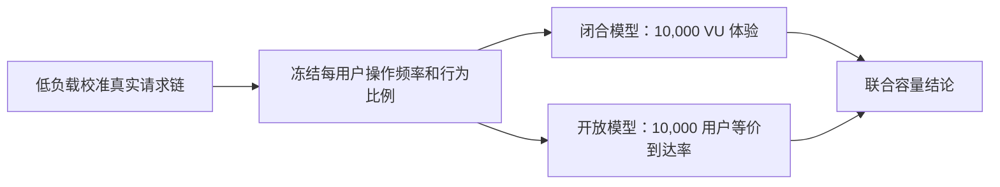

# Phase 14：万级在线购票容量验证与过载恢复方案设计

> 文档状态：已批准，实施中。
>
> 实施前提：Phase 13 由另一个会话完成并合入主分支后，先核对一次最终前端请求链，再冻结本方案的测试配置。
>
> 核心结论：Phase 14 不再重复 Phase 10 已做过的单接口容量阶梯，而是先验证在固定硬件和明确用户行为下，系统能否让 10,000 名活跃用户稳定运行 10 分钟，再在该目标通过时验证 30 至 60 分钟的持续能力；同时单独测量 10,000 人开票购票洪峰和 10,000 人热点抢座。支付只作为低速存活探针，不进入万级容量目标。

## 1. 为什么要做 Phase 14

Phase 10 主要取得了各条隔离链路的“最高已测稳定点”和部分“首次观察不稳定点”，并完成少量 5 分钟观察；结算和支付等链路停止在计划最高档，并没有都找到真实失稳边界。它没有提供 30 至 60 分钟的万人混合证据。因此，秋招项目还需要回答另一个完整问题：开票后有很多用户同时浏览、刷新余票、抢座和下单，另有一批用户集中登录时，系统整体会不会变慢、拒绝失控、形成队列积压，甚至卖出同一个座位两次。

这两个问题不能互相替代。单接口达到较高吞吐，不代表多个资源竞争链路叠加后仍然稳定；同样，“在线 10,000 人”也不等于“每秒 10,000 个请求”。在线用户会阅读页面和选择座位，请求之间存在停顿；开票洪峰则会在短时间内把大量写请求同时压到数据库、Redis（内存键值数据库）和应用线程池上。因此，Phase 14 必须把持续在线体验与短时交易洪峰分别测量，再把两类结果放到同一份容量结论中。

现实场景如下：活动开票前已有大量用户登录并停留在选座页；开票后，多数用户读取页面或刷新余票，部分用户创建临时占座并调整选择，少部分用户确认订单。同时，新用户开始集中登录。成功下单的用户不会在本阶段大规模调用 Stripe（第三方支付渠道），因为外部渠道有独立限流，而且用户已明确不把万级支付作为当前主线。Phase 14 要证明的是，核心购票链路在这段时间内仍然正确、可解释并能恢复。



图中的 `100,000` 表示可以使用的登录会话数量，不表示同时发出 100,000 个请求；`10,000` 表示目标活跃用户数量；模拟支付探针仅在后文指定的在线用户、完整旅程、下单和登录场景中检查已开始的支付任务是否被饿死，热点正确性场景不叠加支付。

## 2. 术语与容量声明的准确含义

本方案后续统一使用下列术语，避免把用户数、并发连接数和请求速率混为一谈。

| 术语 | 本方案中的含义 |
| --- | --- |
| 被测系统（System Under Test，SUT） | 本轮接受压力的后端、PostgreSQL（关系型数据库）、Redis 和相关后台任务；压力机不属于被测系统。 |
| 虚拟用户（Virtual User，VU） | 由 k6（开源负载测试工具）模拟的一个独立用户执行单元。每个 VU 固定绑定自己的用户和登录会话，不能多人共用身份。 |
| 每秒请求数（Requests Per Second，RPS） | 每秒实际开始的 HTTP（超文本传输协议）请求数量。一个用户旅程包含多个请求，所以 VU 数与 RPS 不相等。 |
| 思考时间（Think Time） | 用户阅读页面、选择座位或决定下一步时的等待时间。它使在线用户模型更接近真实行为。 |
| 闭合负载模型（Closed Model） | 固定 VU 数；每个用户完成上一步后才执行下一步，适合回答“10,000 名在线用户的体验如何”。 |
| 开放负载模型（Open Model） | 按预定到达速率持续启动操作，不因系统变慢而自动降压，适合回答“目标压力是否真的送达”。 |
| 协调遗漏（Coordinated Omission） | 被测系统变慢后，闭合模型也跟着减少新请求，导致看起来没有预期中那么拥堵的测量偏差。 |
| 有效吞吐（Goodput） | 真正完成业务目标的数量，例如成功进入完整座位页、成功占座或成功创建订单；快速返回的冲突或繁忙拒绝不算有效吞吐。 |
| 百分位延迟（p95、p99） | p95 表示 95% 的样本不超过该时间，p99 表示 99% 的样本不超过该时间。 |
| 阈值（Threshold） | 测试开始前冻结、由程序自动判断通过或失败的条件，不能看到结果后再修改。 |
| 耐久测试（Soak Test） | 在较长时间内保持稳定压力，用来发现内存增长、连接泄漏和积压。 |
| 洪峰测试（Spike Test） | 在短时间内集中送入大量请求，用来验证过载保护与恢复。 |
| 运行编号（Run ID） | 每次正式运行的唯一标识，用于关联配置、指标、日志和测试数据；它不能作为高基数监控标签（标签值种类会随运行不断增长的指标标签）无限增长。 |
| 场景编号 | `P14-G/U/J/O/H/L/E/S` 分别表示 Phase 14 的预检、在线用户、完整旅程、下单写链、热点、登录、到期回收和耐久测试；后文会省略 `P14-` 前缀。 |
| 到达率执行器 | 按预定速率启动操作的 k6 调度组件，不等待上一个操作完成。 |
| 波次模型 | 在固定时间窗口内集中启动一批操作的负载模型。 |
| k6 分片 | 由一个 k6 进程承担的一部分用户和请求；多个分片共同产生总压力。 |
| 统一汇总器 | 合并所有分片的原始样本并重新计算全局计数和百分位的固定版本程序。 |
| 测试夹具 | 用于准备固定前置数据与状态的脚本或程序。 |
| 在途请求量 | 已经开始但还没有完成的请求数量。 |
| 高水位 | 一个观测窗口内某项数值实际达到的峰值。 |
| 内存耗尽（Out Of Memory，OOM） | 进程或容器超过可用内存后被系统终止或无法继续分配内存。 |
| 幂等键（Idempotency Key） | 标识同一次逻辑操作的稳定编号。网络重试必须复用它，使后端或渠道只产生一份业务结果。 |
| JSON（JavaScript Object Notation，结构化文本格式） | 本方案保存配置、逐点样本和自动判定结果所用的机器可读格式。 |
| HTTP 状态码族（2xx、5xx） | 2xx 表示 HTTP 请求被成功接收或处理；5xx 表示服务器一侧发生错误。业务是否真正成功仍要检查响应内容和数据库状态。 |
| 模拟 Stripe（Fake Stripe） | 项目内可控制成功、失败、延迟和回调的支付渠道替身；正式负载测试不调用真实 Stripe 测试环境。 |
| 支付探针（Payment Sentinel） | 与主压力并行运行的固定低速支付流程，只判断支付任务是否被饿死，不推导支付容量上限。 |

### 2.1 新人需要先理解的购票数据关系

Event（活动）包含多个 Session（场次），每个场次通过 SessionSeat（场次座位）记录这一个座位在本场的正式库存状态。用户在正常页面中先创建 CheckoutSession（结算会话）；此时 Redis 中的 Hold（短期占用）只阻止其他用户继续选择相同座位，可以到期或丢失，并不代表 PostgreSQL 已经生成订单。



正常前端确认 `CheckoutSession` 时，后端复用正式预订核心，在同一个 PostgreSQL 事务中创建 Reservation（预订）和 Order（订单），并把全部 SessionSeat 原子改成 `HELD`（正式占用）。此时 Reservation 为 `ACTIVE`（有效待支付），Order 为 `PENDING_PAYMENT`（待支付）；Phase 14 所说的“预支付旅程”就停在这里。支付成功后才会变成 `PAID / CONFIRMED / SOLD`（订单已支付、预订已确认、座位已售），但这不是万人主压力的一部分。

项目还保留较底层的 `POST /reservations` 正式预订接口；正常页面不直接调用它，结算确认内部复用相同的正式库存能力。因此 H1/H3 分别测试 `POST /checkout-sessions` 的 Redis 临时竞争和 `POST /reservations` 的 PostgreSQL 正式竞争：它们保护的是同一张票的两个不同阶段，不能只测其中一个。

本阶段允许形成的最终声明必须是：

> 在已记录的硬件、部署拓扑、代码版本、数据规模和用户行为模型下，10,000 名活跃用户在 10 分钟目标段通过或未通过；若继续完成 S1，则另行声明该模型在 30 分钟或 60 分钟内是否持续稳定。10,000 个购票流程只按实际测试的到达窗口给出结论，登录洪峰则单独给出隔离与恢复结论。

不得把结果简化为“支持十万并发”或“支持 10,000 RPS”，因为这两句话描述的是不同且本阶段没有直接证明的能力。

## 3. Phase 10、Phase 13 与 Phase 14 的边界

### 3.1 Phase 10 已有证据如何处理

Phase 10 的测试代码、指标框架、数据生成器和历史结果全部作为 Phase 14 的基础，不重新编写同义脚本，也不把相同档位再次计入 Phase 14 的新增成果。

| Phase 10 已有内容 | Phase 14 的处理方式 | Phase 14 新增问题 |
| --- | --- | --- |
| 公开读取达到 10,000 请求/秒 | 直接引用历史证据，不再跑相同公开读取阶梯 | 当读取、余票刷新、抢座和下单同时发生时，整体是否稳定 |
| 登录 40 次/秒为最高已确认稳定点，45 次/秒首次观察到不稳定和容量拒绝 | 不重新寻找单独登录边界 | 10,000 次集中登录能否被快速、明确地接纳或拒绝，并且不拖垮已登录购票用户 |
| 5,000 座页面进入、余票读取和既有混合读取 | 复用请求与指标组件，不重复原负载档位 | 10,000 名用户在明确目标时段内执行真实页面请求链时的体验 |
| 结算最高测试到 160 位买家/秒 | 作为新测试的已知起点，不重跑旧阶梯 | 恰好 10,000 个不同用户完成完整预支付流程，以及洪峰后的恢复 |
| 100、500、1,000 人抢同一座位 | 不重跑这些规模 | 直接扩展到 10,000 人，并增加多热点与跨场次对照 |
| 支付启动和支付生命周期容量 | 继续作为回归证据 | 只增加低速支付探针，验证购票洪峰下任务不被饿死 |

Phase 14 仍会执行现有单元测试、集成测试、数据库不变量校验和源码契约检查，因为这些属于修改后的回归门禁；但不会重复 Phase 10 的完整容量爬坡，也不会把回归门禁包装成新的容量结论。

### 3.2 Phase 13 的衔接方式

Phase 13 正由另一个会话处理。Phase 14 不预判它最终修改的页面请求顺序、登录恢复行为或座位交互方式。Phase 13 合入后，Phase 14 只用少量真实浏览器请求做一次请求链校准：确认页面实际请求了哪些接口、哪些请求并行、何时刷新余票，以及身份与防跨站请求伪造令牌如何携带。这个动作只是校准压力脚本，不重新验收 Phase 13 的功能。

### 3.3 本阶段明确不做的内容

Phase 14 不测试 10,000 人同时支付，不用真实 Stripe 测试环境压测，不引入 Kubernetes（容器编排平台）或新的消息队列，也不先扩大数据库连接池来追求漂亮数字。电子票生成、验票核销、跨地域部署、100,000 个持续活跃 VU 和生产容量承诺均不属于本阶段。

如果测试发现瓶颈，本阶段先给出可复现证据和原因。连接池、线程池、缓存、到期回收算法或部署拓扑的优化应形成单独的 Phase 14 后续改进项，经审核后再实施，不能在同一轮测量中边跑边调，否则无法判断结果变化来自哪里。

## 4. 外部参考与本项目采用的部分

成熟项目提供的是测量方法，而不是可以直接搬用的吞吐数字。不同项目的硬件、业务锁、库存模型和接口成本差异很大，因此本方案只采用可解释的方法，并用本项目自己的数据决定结论。

| 参考资料 | 可借鉴内容 | 本方案的取舍 |
| --- | --- | --- |
| [k6 开放与闭合负载模型](https://grafana.com/docs/k6/latest/using-k6/scenarios/concepts/open-vs-closed/) | 闭合模型会在系统变慢时降低到达率；开放模型按独立到达率发压 | 两种模型都测：前者描述在线用户体验，后者验证等价压力确实送达 |
| [k6 未启动迭代说明](https://grafana.com/docs/k6/latest/using-k6/scenarios/concepts/dropped-iterations/) | 到达率执行器资源不足时会产生未启动迭代 | 正式容量通过要求未启动迭代为零，并同时检查压力机资源 |
| [k6 分布式测试指南](https://grafana.com/docs/k6/latest/testing-guides/running-distributed-tests/)与[大规模测试指南](https://grafana.com/docs/k6/latest/testing-guides/running-large-tests/) | 大规模测试应切分执行分片并监控压力机，避免压力机先饱和 | 使用少量独立 k6 分片和统一汇总器，不为个人项目引入完整集群编排 |
| [k6 标签规则](https://grafana.com/docs/k6/latest/using-k6/tags-and-groups/)与[逐点 JSON 输出](https://grafana.com/docs/k6/latest/results-output/real-time/json/) | 默认标签可能包含动态网址；逐点输出可以汇总多个分片的真实样本 | 显式限制标签，并用逐点样本计算全局分位数，不合并各分片已经算好的 p95 |
| [Hi.Events 的 k6 购票脚本](https://github.com/HiEventsDev/Hi.Events/blob/develop/misc/k6/README.md) | 按完整购票漏斗、售罄冲突、限流、5xx 和每一步延迟分别统计，并在结束后读取权威库存 | 采用“完整旅程 + 分结果类型 + 最终库存校验”；不照搬其 800/1,500 毫秒阈值和吞吐数字 |
| [pretix 扩容指南](https://docs.pretix.eu/self-hosting/scaling/) | 票务系统把正确性放在吞吐之前；数据库锁和任务隔离会决定容量 | 任何超卖或状态不一致直接否决测试；热点对照用于识别锁的作用范围 |
| [Google Online Boutique（在线商店示例系统）负载生成器](https://github.com/GoogleCloudPlatform/microservices-demo/blob/main/src/loadgenerator/locustfile.py) | 使用带权重的用户动作和随机等待来模拟行为，并对外部支付使用替身 | 采用可重现的用户分群与思考时间；浏览器只校准协议，不启动 10,000 个浏览器 |
| [PostgreSQL 16 统计视图](https://www.postgresql.org/docs/16/monitoring-stats.html)与[锁视图](https://www.postgresql.org/docs/16/view-pg-locks.html) | `state`（连接状态）与 `wait_event`（等待事件）含义不同，数据库统计需要与操作系统指标结合；锁视图可识别未授予锁 | 修正当前把空闲 `ClientRead`（空闲连接等待客户端命令）也算等待的口径，并保存活动阻塞链与运行前后增量 |
| [Drogon（C++ 后端网络框架）数据库事务说明](https://github.com/drogonframework/drogon/wiki/ENG-08-2-Database-Transaction) | 一个事务会独占数据库连接，异步事务需要等到连接可用后才通过回调交付 | 观测事务连接获取等待，但不把它冒充所有普通查询的连接池等待 |
| [Google 站点可靠性工程（Site Reliability Engineering，SRE）四个黄金信号](https://sre.google/sre-book/monitoring-distributed-systems/) | 延迟、流量、错误和饱和度需要同时观测，失败请求的延迟应与成功请求分开 | 不用“总平均响应时间”判断容量，按场景、步骤和结果类型分别统计 |
| [Stripe 限流与负载测试建议](https://docs.stripe.com/rate-limits) | Stripe 明确不建议用测试环境做负载压测，并建议用可配置模拟服务；测试环境全局限制为每秒 25 个请求 | 正式压力只调用 Fake Stripe；真实 Stripe 仍由 Phase 11/12 的低量验收覆盖 |

## 5. Phase 14 要回答的六个问题

第一，项目能否准备 100,000 个互不混用、仍在有效期内的登录会话，并让压力脚本稳定取用。这个结论只证明数据池规模，不证明 100,000 人同时请求。

第二，10,000 名用户带着真实的页面停顿在线运行 10 分钟时，页面进入、余票刷新、临时占座和确认订单是否仍满足延迟、错误率与数据库正确性要求；若该目标通过，再用 S1 判断同一负载能否持续 30 至 60 分钟。

第三，闭合模型可能因系统变慢而自行降压，因此必须把健康校准得到的每用户操作强度换算成开放到达率，再验证同等目标压力是否真的被送达并处理。

第四，开票后的 10,000 个用户分别在 60 秒、30 秒和 10 秒窗口内到达时，完整页面到下单的端到端链路能否承受；如果失败，预先准备页面数据后单测下单写链，又能承受哪个窗口。`10,000 ÷ 60 ≈ 166.7` 位买家/秒，`10,000 ÷ 30 ≈ 333.3` 位买家/秒，`10,000 ÷ 10 = 1,000` 位买家/秒；这些是用户旅程的启动速率，不是单个 HTTP 接口的 RPS。

第五，10,000 人争抢热门座位时是否始终不超卖，并且热点是否只影响本场次，而不是拖慢所有场次。

第六，10,000 次集中登录超过当前认证能力后，系统能否快速返回明确的认证繁忙结果，同时保护已经登录用户的浏览、抢座和下单，并在洪峰结束后自动恢复。

## 6. 测试环境与数据设计

### 6.1 正式环境边界

Phase 10 的部分结果来自压力机与被测系统共享 Docker Desktop（桌面容器运行环境）和 WSL（Windows 的 Linux 子系统）资源的环境，这类结果适合开发诊断，但不能单独证明正式容量。Phase 14 分成两种运行：

- 本地预演只检查脚本、数据、指标和停止保护是否正确，不产生容量结论。
- 正式运行优先把被测系统与压力生成器放在不同物理主机。如果只能使用同一宿主机上的虚拟机，必须分配互不重叠的中央处理器（Central Processing Unit，CPU）核和固定内存，并记录 CPU steal（虚拟机被宿主抢占的处理器时间）、输入输出等待（I/O wait）及宿主资源争用；不能证明资源隔离时，结果只能称为“本机特征”，不能称为正式容量。

按当前项目结构，Phase 14 的第一套基准拓扑固定为：单个 Drogon 后端实例、单个 PostgreSQL 实例、单个 Redis 实例和独立 Fake Stripe，不放置负载均衡器。Phase 13 合入后先复核这一事实并记录具体 CPU、内存、网络和磁盘规格；容器必须配置可读取的明确内存上限。若后续增加后端实例或其他组件，那是新的拓扑实验，必须使用新的配置和结论，不能与单实例数字合并。

不预先规定必须有四台压力机。先从足以承载目标 VU 的少量 k6 实例开始，如果任一压力机 CPU 持续达到 80%、内存达到 90%、发生交换、网络饱和、文件描述符不足或出现未启动迭代，则该轮标记为“测量无效”，增加压力机后重跑，不能把压力机瓶颈归因于项目后端。

每次正式运行都记录 Git（版本控制系统）提交、Phase 13 提交、配置哈希（根据配置内容计算的指纹）、容器镜像摘要、主机规格、操作系统限制、压力机数量、时钟偏差和开始时间。测试期间不能修改连接池、线程数、队列长度或数据库参数。

每个容量档位从同一个只读基础快照恢复出新的 PostgreSQL 数据卷，并清空专用 Redis 数据；完成证据与不变量校验后再销毁该档的临时环境。这样，上一档留下的待支付订单、临时占座和缓存不会在各自到期后污染下一档。恢复和销毁只能由现有双重目标保护的性能环境流程执行，不能指向开发或 Phase 13 环境。

### 6.2 数据规模

在 Phase 10 的确定性数据生成器上新增 `phase14-1m-users-100k-auth` 配置名。该名称表示“Phase 14 的百万注册用户、十万认证会话数据集”，不是接口名，也不表示百万并发。建议数据如下：

| 数据 | 数量 | 用途 |
| --- | ---: | --- |
| 注册用户 | 1,000,000 | 复用 Phase 10 已支持的百万用户基数；它不是百万并发目标，并为登录洪峰保留无既有会话的独立账号 |
| 有效登录会话 | 100,000 | 支持 10,000 活跃用户、多轮全新身份及分片隔离 |
| 登录洪峰专用账号 | 10,000 | 从其余注册用户中固定划出，运行前没有有效登录会话，不与已登录购票用户重叠 |
| 活动 | 2 | 沿用 Phase 10 的多活动结构，便于比较热点是否跨活动扩散 |
| 每个活动的场次 | 10 | 共 20 个场次，便于把相同总压力集中或分散 |
| 每场座位 | 5,000 | 共 100,000 个场次座位，足够为低冲突流程分配唯一库存 |

这里的“场次”对应业务 Session，“登录会话”对应 Auth Session；两者名称相似但含义完全不同。若 Phase 13 合入后数据库结构或现有数据配置改变，实施时调整生成器字段，但不降低数量目标。

数据必须按运行编号和压力分片确定性切开。普通场景中，各分片使用互不重叠的用户、登录会话、座位和幂等键；只有热点抢座场景允许多个用户共享目标座位。相同随机种子必须得到相同的用户分群和座位选择，以便复现失败。

### 6.3 会话数据的可信性

直接向数据库写入 100,000 行并不等于这些预置会话真的能通过真实认证。数据门禁需要验证令牌摘要唯一、会话未过期且未撤销、用户归属正确、防跨站请求伪造数据完整，并从校准专用切片抽取 1,000 个会话分别经过冷缓存和热缓存的真实认证请求。这里的冷缓存表示 Redis 中没有对应认证记录，热缓存表示记录已经预载；该切片不能与正式 U/J/O/H 场景共用，防止抽样改变正式用户的缓存和最后访问时间。抽样失败会停止正式压力测试。

现有认证配置会按固定间隔更新 `last_seen_at`（最后访问时间），认证缓存也有独立有效期。如果 100,000 个会话都带完全相同的最后访问时间，测试运行到更新间隔时会产生人为同步写入洪峰。主数据集因此按当前配置的更新间隔确定性打散最后访问时间，并保持空闲到期时间与之相容；实施前重新读取 Phase 13 合入后的认证配置，不能把当前 300 秒写死在脚本中。

U1、U2、J1、O1 和 H 类场景模拟的是“用户已在开票前登录”，所以它们的主结论明确限定在热认证缓存初态。正式计时前按目标爬升节奏逐步预热认证缓存，等待系统恢复；随后清零或重新标记本轮指标，但不得清除刚预热的缓存。不能瞬间预热 10,000 个键，也不能把预热流量混入容量结果。

预热完成后还要按 `last_seen_at + write_interval`（最后访问时间加写回间隔）计算目标 10,000 个会话下一次需要写回的时间桶，确认它们仍分散在整个写回间隔内；如果预热把写回时间重新聚成同一秒，必须修正夹具后再测。L1/L2 使用没有预存登录会话、没有缓存键的专用账号，真实执行密码校验。Phase 10 已有冷、热和 Redis 不可用认证测试，Phase 14 不重新寻找这些单路径边界。

## 7. 用户行为与请求链

Phase 14 不运行 10,000 个真实浏览器。浏览器渲染会让压力机先消耗大量 CPU 和内存，也不能更准确地测后端。少量 Playwright（浏览器自动化工具）在 Phase 13 合入后记录真实请求顺序；k6 随后用 HTTP 层复现同一业务协议。

单个预支付用户旅程如下：



目标在线模型使用固定随机种子把 10,000 名用户分成三组：60% 只浏览并刷新余票，25% 创建临时占座后调整或放弃，15% 完成预支付订单。`60%/25%/15%` 是本项目为了覆盖读、临时写和正式写而定义的合成压力比例，不冒充真实商业转化率；如果以后取得真实流量数据，应新增配置版本，而不是覆盖本次证据。

U1 中的每个 VU 是一个持续存在的用户状态机，不能在每次脚本迭代时重新分群。用户启动时只确定一次身份和分组；临时占座分支最多执行一次，确认订单分支也最多执行一次，完成后转入浏览状态。浏览状态每隔 30 至 90 秒刷新一次动态余票，使 10,000 个身份在整个目标窗口内持续在线并产生可控活动；单次购买链内部的阅读和选择间隔使用 1 至 10 秒的确定性随机思考时间。

30 至 90 秒的均匀间隔平均约为 60 秒；当 10,000 人都进入浏览状态时，理论平均刷新强度约为 `10,000 ÷ 60 ≈ 166.7` 次/秒。它低于 Phase 10 已测的 200 次/秒独立余票稳定点，但 Phase 14 还会叠加写请求，所以仍需要 U1/U2 重新判断组合结果。这一换算也说明行为参数不是为了凑出“10,000 RPS”。

一个购票用户在一轮内最多确认一个订单，不能无限循环购买。遇到预期座位冲突时，只刷新一次余票并结束该次购买；遇到确认请求响应不明确时，使用同一个结算身份和幂等信息恢复，不能新建第二笔逻辑购买。U1 的运行证据必须确认目标阶段实际存在 10,000 个活跃 VU、10,000 个不同身份都已进入状态机，并且没有被提前中断。

## 8. 为什么要同时使用两种负载模型

只用 10,000 个 VU 会出现一个隐藏问题：如果后端响应从 100 毫秒变成 5 秒，每个 VU 都会等更久，因此单位时间内发出的后续请求会减少。测试仍然显示“10,000 VU 在线”，但系统实际承受的到达压力已经下降。

Phase 14 采用下面的闭环解决：



行为比例、思考时间、刷新间隔和每个用户最多一次购买共同决定理论输入频率。实施脚本先根据这些已写死的行为规则计算 10,000 用户应产生的旅程启动速率，并写入只读的 `phase14-targets.json`。文件名表示 Phase 14 的冻结目标配置。G0 使用低速真实后端请求验证业务链，再让每台压力机对同机回环地址上的临时 no-op（空操作）服务按目标计划做一次发压能力预演。该服务位于 SUT 之外，必须单独证明资源有余量，运行结束即删除；不得在生产后端增加测试空接口。此预演只验证执行器、分片、内存和调度能力，不证明业务或真实网络容量，也不反过来从系统响应速度“测出”用户行为。

U2 重放与 U1 相同的分段输入，而不是在 10 分钟内不断制造新的购买者。用户进入场景按 U1 的 2,500、5,000、10,000 爬升时序只启动一次，并按 60/25/15 分成完整浏览、完整临时占座和完整确认订单三类初始旅程；每个旅程内部保留前后依赖，例如确认订单必须使用该迭代先创建的结算会话。持续余票刷新则使用单独的开放到达场景，随着已进入用户数按约 41.7、83.3、166.7 次/秒分段增加，这三个数分别来自 `2,500/5,000/10,000 ÷ 60 秒平均刷新间隔`。

这样，U2 中每个身份仍然最多购买一次，初始购买总量与 U1 相同，只有后续刷新由开放模型保证不随系统变慢而降压。若实现后 U1 与 U2 的计划用户数、分组数或分段刷新数不一致，U2 只能叫“混合压力”，不能叫等价输入，正式运行必须在 G0 阶段先修正。

只有闭合模型和对应的开放模型都通过，才能声明目标 10,000 活跃用户在本方案的 10 分钟目标段通过。闭合模型失败说明用户体验不合格；闭合模型通过但开放模型失败，说明前者可能因协调遗漏而少送了压力。

## 9. 正式测试矩阵

下表中的编号只是运行用例标识，不是业务订单号。`P14` 表示 Phase 14；字母 G、U、J、O、H、L、E、S 依次表示预检（Gate）、在线用户（User）、完整旅程（Journey）、下单写链（Order）、热点（Hotspot）、登录（Login）、到期回收（Expiry）和耐久（Soak）。例如，`P14-U1` 表示第一项在线用户测试。

其中 U、J、O、H、L 和 S 直接回答本阶段的高并发核心问题；G 保证测量可信。E1 是与订单洪峰相关的补充现状刻画，支付则只是存活探针；二者都不能扩大或替代核心容量结论。

| 编号 | 要回答的问题 | 新增负载 | 持续与升档规则 | 允许形成的结论 |
| --- | --- | --- | --- | --- |
| P14-G0 | 数据、请求链和压力机是否可信 | 低负载走完所有真实业务分支；校验 100,000 会话并抽样 1,000 个；对压力机本地临时空操作服务验证目标调度 | 只做校准，不计容量；冻结目标后不得改 | 可以进入正式测试，不能声明业务或网络容量 |
| P14-U1 | 10,000 名在线用户在目标窗口内的体验如何 | 闭合模型依次达到 2,500、5,000、10,000 VU；每个 VU 固定身份和分组，购买至多一次，之后持续浏览 | 前两档各 5 分钟；目标档 10 分钟，并在全新数据上重复一次 | 只能声明闭合模型中的 10,000 用户在所测 10 分钟目标段通过；还不能单独形成总容量结论 |
| P14-U2 | U1 是否因为系统变慢而少送压力 | 用开放模型重放与 U1 相同的一次性用户进入和 60/25/15 初始旅程，并按活跃人数分段保证后续余票刷新速率 | 完整重放 U1 第一轮的爬升与保持时序，并在全新数据上重复一次 10,000 用户目标段 | 与 U1 同时通过，才证明“万级活跃用户模型在所测 10 分钟目标段通过” |
| P14-J1 | 真实开票端到端链路能否承受万人到达 | 每人使用独立身份和无冲突座位，执行完整页面进入、占座、确认和读取订单 | 先在 60 秒内启动 10,000 流程；通过后才测 30 秒，再通过才测 10 秒 | 公布真实端到端有效订单数；失败代表完整购票体验未达标 |
| P14-O1 | 排除已知大座位页读取成本后，下单写链的能力如何 | 在计时窗口前准备并校验静态页面数据；窗口内只执行创建结算会话、设置座位、确认和读取订单 | 同样按 60 秒、30 秒、10 秒递进，每档使用全新身份和无冲突座位 | 公布下单写链的有效吞吐；不能把结果冒充完整页面到订单容量 |
| P14-H1 | 现实多热点是否正确 | 分别通过 `POST /checkout-sessions` 临时占座路径和 `POST /reservations` 正式预订路径运行；每条路径都让 10,000 个用户在一个专用场次中竞争 1,000 个座位，每座恰好 10 名竞争者 | 两条路径使用独立新数据，各在 10 秒内送达并固定重复一次 | 每条路径完整送达时都应为 1,000 个胜者和 9,000 个业务冲突，并公布热点延迟 |
| P14-H2 | 正式预订的竞争影响范围在哪里 | 复用 H1 正式预订结果作为“一个场次”对照，不重跑；另做同一活动 10 个场次和两个活动 20 个场次两轮。每轮仍为 1,000 个热点座位、每座 10 人，分别按每场 100 座和每场 50 座均匀分布 | 新增两轮仍各在 10 秒内送达，使用相同资源配置、固定种子和独立新数据 | 三轮延迟差异只用于提出候选影响范围；必须再由数据库阻塞链、热点语句和应用等待证据确认，证据不足时不声称锁的层级 |
| P14-H3 | 极端单热点能否不超卖 | 临时占座与正式预订各做一轮；每轮预置 10,000 VU，在统一的协调世界时（Coordinated Universal Time，UTC）竞争同一个座位 | 有效“近同时”要求 95% 请求在目标时刻后 1 秒内开始、全部请求在 2 秒内开始；不重跑 Phase 10 的 100/500/1,000 档 | 每条路径完整送达时都只能有精确 1 个成功、9,999 个业务冲突，且无容量拒绝或系统错误 |
| P14-L1 | 登录洪峰会不会拖垮已登录用户 | 10,000 个有效账号在 60 秒内登录；叠加下文冻结的“活跃浏览 + 持续低冲突临时占座 + 持续低冲突下单”背景 | 背景先稳定 2 分钟再开始登录，登录后继续 5 分钟；与全新数据上的完全同速无登录轮比较 | 可以声明浏览、临时占座和下单是否得到隔离保护及系统能否恢复，不能声明 10,000 次登录全部成功 |
| P14-L2 | 更短登录洪峰的保护效果 | 只有 L1 的受控拒绝、背景业务和恢复全部通过后，才把登录压缩到 10 秒；已登录背景输入与 L1 完全相同 | 先跑一轮无登录的同速背景对照，再叠加 10,000 次登录；出现非受控故障即停止 | 可以描述约 1,000 次登录尝试/秒下的保护结果，不能称为成功登录吞吐 |
| P14-E1 | 大量未支付订单到期后，当前回收能力是多少 | 用独立测试夹具创建并预先校验 10,000 组合法的待支付订单、预订和已占座位，使它们具有同一未来到期窗口；不发起支付 | 从到期前开始观察，最长观察到到期后 20 分钟；若提前排空则再观察 2 分钟，不通过改数据库加速 | 这是现状刻画，不设置当前架构无法达到的强制排空门槛；公布积压曲线、最老超期时间、有效吞吐和全部释放时间，未排空则公布剩余量 |
| P14-S1 | 稳定负载长期运行是否泄漏或积压 | 若 U1/U2 目标通过，则使用 10,000 VU 模型；否则使用 U2 最高稳定输入负载的 70%，不能用输出的有效吞吐反推压力 | 先持续 30 分钟；资源允许时延长到 60 分钟 | 证明指定稳定档在该时长内没有持续恶化，不外推到更长时间 |

U1 第一轮的精确爬升为：2 分钟增加到 2,500 VU 后保持 5 分钟，再用 2 分钟增加到 5,000 VU 后保持 5 分钟，最后用 5 分钟增加到 10,000 VU 并保持 10 分钟。第二轮使用新数据，在 5 分钟内增加到 10,000 VU，再保持 10 分钟。只有保持窗口中的数据进入容量判定，爬升段用于观察趋势和安全停止。U2 必须先完整执行同样的 2,500、5,000、10,000 分档，因此后文所说的“U2 最高稳定输入”只能来自 U2 自己已经通过的分档；如果 U2 连 2,500 档都没有稳定结果，则不执行代表容量的 S1，只能做另行标注的低负载诊断。

J1 与 O1 必须同时保留，因为它们回答不同问题。Phase 10 已知 5,000 座完整页面进入的稳定档约为 60 页/秒，而 J1 的第一档已经要求约 166.7 次完整页面进入/秒，所以 J1 很可能先在读取链路暴露瓶颈；此时不能把失败解释成订单写入能力不足。O1 在计时前准备静态页面数据，专门测量下单写链。

J1 和 O1 每个流程都固定购买一个座位。10,000 个无冲突座位平均分到 20 个场次，即每场使用 500 个独立座位；用户、结算会话和座位都不跨分片复用。这样，业务冲突应为零，测试测到的是页面链或下单链容量，而不是库存不足。

O1 的 60 秒档虽然约为 166.7 位买家/秒，接近 Phase 10 的 160 位买家/秒，但它不是简单重复：Phase 10 的旧档只持续约 10 秒，而 O1 要求恰好 10,000 个不同用户、持续 60 秒、使用全新数据，并补充恢复与逐订单一致性证据。30 秒和 10 秒档则是全新的更高压力。

1 秒内启动 10,000 个完整购票流程不作为必做门禁。只有 10 秒档稳定、压力机仍有余量且用户另行批准，才可把它作为破坏性极限实验；它的结果只能描述该固定环境的崩溃边界。

L1/L2 不直接启动 U2 再猜测登录应落在哪个时刻，而是使用独立的稳定背景。若 U1/U2 万人目标通过，背景先让 10,000 个已登录身份进入浏览状态，按 30 至 90 秒间隔产生约 166.7 次/秒的余票刷新；同时用开放模型持续启动每秒约 5.21 个低冲突临时占座旅程和每秒 3.125 个低冲突下单旅程。这两个写入速率来自 U2 最快爬升段的 `2,500 ÷ 120 秒 × 25%` 与 `2,500 ÷ 120 秒 × 15%`，不是测试后临时挑选的数字。

如果 U1/U2 万人目标未通过，则先取 U2 已通过的最高稳定人数 `N`，把背景人数设为 `0.7 × N`，余票刷新、临时占座和下单的三个输入速率也按 `0.7 × N ÷ 10,000` 同比例缩放；U2 没有稳定档时不运行 L1/L2。每轮先让背景稳定运行 2 分钟，再开始登录波次，登录结束后背景继续运行完整 5 分钟恢复期。无登录对照必须在全新数据上使用相同背景、随机种子、持续时间和支付探针。这样才有资格说登录洪峰同时保护了浏览、临时占座和下单，而不只是保护余票刷新。

L1/L2 中的 10,000 表示登录提交次数。每次成功登录后追加的身份读取只用于校验登录态，单独计数，不算进这 10,000 次提交。现有受控繁忙错误码 `AUTH_BUSY` 表示密码计算队列已满；它的“快速拒绝”直接冻结为 p95 不超过 1 秒、p99 不超过 2 秒，不能因为看到 L1 结果后再调整。

登录叠加时，已登录背景链本身必须零系统错误、零非预期结果、零容量拒绝；其有效吞吐不得低于同速无登录对照的 90%，各步骤 p95 既要满足第 14 节绝对阈值，也不得超过对照的 1.5 倍。登录成功数与 `AUTH_BUSY` 数之和必须等于实际送达的登录提交数，否则说明有请求消失，过载保护失败。

每个正式容量或洪峰场景还并行运行固定低速控制请求：健康检查、已登录身份读取和无冲突余票读取各 2 次/秒。这个速率只为了在 60 秒恢复窗口内分别得到至少 120 个样本，不用于推导这些接口的容量。

## 10. 支付为何只保留低速探针

Phase 10 已有支付启动与生命周期容量证据，Phase 11 和 Phase 12 又覆盖了真实 Stripe、崩溃恢复、退款和幂等。继续做 10,000 人支付既会重复主线之外的工作，也会把外部渠道限流混入本地购票容量。

Phase 14 因此只在 U1、U2、J1、O1、L1 和 L2 中固定运行 2 个支付流程/秒，H1 至 H3 的热点正确性测试不叠加支付，避免额外写入污染极端竞争结果。`2 个流程/秒` 表示每秒启动两笔完整模拟支付，不是两个 HTTP 请求，因为一笔支付可能包含创建、轮询和回调。探针使用 Fake Stripe 的“只成功”模式，并按固定随机种子让每笔渠道结果在 2 至 6 秒后可见；失败、超时和后续冲正仍由 Phase 11/12 回归覆盖，不混进本轮容量结果。其目标只有两个：

- 在在线混合、登录和完整购票或下单洪峰期间，每笔探针从启动起 30 秒内都必须到达唯一成功终态：本地 PaymentAttempt（支付尝试）为 `SUCCEEDED`（成功）且被接纳，Order 为 `PAID`，Reservation 为 `CONFIRMED`，Seat 为 `SOLD`。
- 同一个本地幂等键在渠道侧只能对应一个 PaymentIntent（支付意图），重复创建、重复接纳、跨表状态不一致或超过 30 秒仍为 `PROCESSING`（处理中）都使该轮稳定容量判定失败。主压力停止后继续等待最后一笔探针满 30 秒，再要求处理中数量为零。

探针使用预先独立准备且数量充足的用户、订单和座位，绝不支付 J1、O1 或 E1 的样本。创建、查询和回调均按本地支付尝试及幂等键对账，渠道对象数、被接纳尝试数和成功订单数必须相等。它的结果不参与“万级购票”的有效吞吐，也不能据此宣称系统支付容量为每秒两笔或更高。真实 Stripe 测试环境完全不参与负载测试。

## 11. 结果必须如何分类

如果把 HTTP 409（资源冲突）、429（请求过多）或快速 503（服务暂不可用）都算作成功请求，图表可能很好看，但用户并没有买到票。Phase 14 对每个逻辑步骤统一记录以下五种结果：

| 类别 | 例子 | 是否计入有效吞吐 |
| --- | --- | --- |
| 业务成功 | 页面数据完整、占座成功、订单创建成功 | 是 |
| 业务冲突 | 座位已被其他用户占用、库存售罄 | 否；热点场景中是预期结果 |
| 受控容量拒绝 | `AUTH_BUSY`（密码计算队列已满）、`SEAT_MAP_BUSY`（座位图计算队列已满）、设计内的 429（请求过多）或明确 503（服务暂时繁忙） | 否；只用于证明过载保护 |
| 系统错误 | 超时、连接重置、非预期 5xx、响应无法解析 | 否，并使稳定容量判定失败 |
| 非预期契约结果 | 状态码可接受但字段、身份或状态不符合契约 | 否，并使测试失败 |

每个步骤必须满足：

```text
实际开始数 = 业务成功数 + 业务冲突数 + 受控容量拒绝数 + 系统错误数 + 非预期契约结果数
```

式中的“实际开始数”指压力机已经发出的逻辑操作数。开放模型还要同时保存计划到达数、实际开始数、完成数和未启动迭代数。任何数量对不上，都说明证据不完整，该轮不能出容量结论。

延迟必须按场景、业务步骤和结果类型分开统计。特别是成功响应与快速拒绝不能合并，否则大量快速 503 会错误地降低总体 p95。

## 12. 当前观测缺口与最小补强

Phase 10 已具备 HTTP、座位计算、密码哈希、PostgreSQL、Redis、容器及部分业务指标。Phase 14 不推倒重做，只补足无法解释万级混合压力的缺口。

| 当前问题 | 为什么会误判 | Phase 14 的最小补强 |
| --- | --- | --- |
| PostgreSQL 指标把所有非空 `wait_event` 都算等待 | 空闲连接等待客户端命令时也可能显示 `ClientRead`，这不代表数据库锁住 | 只统计目标数据库、目标应用、客户端后端中满足 `state='active' AND wait_event IS NOT NULL` 的连接，并按等待类型和事件分组 |
| 只看数据库已有连接，无法看事务申请连接前的等待 | 请求可能尚未拿到独占事务连接，数据库端看不见这段时间 | 在调用 `newTransactionAsync`（Drogon 异步事务获取接口）前开始计时，在回调获得事务或失败时结束；只将它命名为“事务连接获取等待”，记录等待时长、等待者数量和最老等待年龄 |
| 普通异步 SQL 没有独立的连接池排队证据 | `execSqlAsync`（Drogon 普通异步查询接口）从调用到回调同时包含客户端排队、网络和数据库执行 | 记录普通数据库操作的端到端时延，并与数据库执行统计对照；没有更底层证据时不声称已精确量出普通查询的连接池等待 |
| 只有测试结束时的锁快照 | 短暂但严重的热点锁可能在收尾前消失 | 长场景每秒轻量采样 `wait_event_type='Lock'`（锁等待类型）或未授予锁；只有发现锁等待时才限频调用 `pg_blocking_pids`（查找阻塞者的数据库函数）保存阻塞链。H3 另用下文的短时采样规则 |
| 总 HTTP 延迟混合了成功与拒绝 | 快速失败会让总体分位数看似改善 | k6 按步骤和结果分类记录独立延迟与计数 |
| 缺少应用事件循环和每类请求在途量 | 无法区分 CPU 阻塞、排队和下游等待 | 增加事件循环延迟、固定路由组在途请求及高水位指标 |
| Redis 只有服务端概览 | 应用端变慢可能来自客户端排队、网络或 Redis 执行，单一总耗时无法独立区分 | 按固定客户端与操作记录调用到回调的复合耗时、超时和在途量，再与 Redis 命令统计、延迟统计、网络和可获得的客户端池证据关联分析 |
| 到期订单回收任务缺少积压年龄 | 当前源码的默认批量为每轮 100 个、轮次间等待 5 秒；即使忽略处理耗时，10,000 个同时到期订单也至少需要约 500 秒，可能长期占座 | 增加已到期未处理数量、最老超期年龄、每轮耗时、处理结果和失败计数；实施前按 Phase 13 后的源码再核对此默认值 |
| 压力机只有零散资源信息 | 压力机饱和会伪装成后端吞吐不足 | 每个分片持续记录 CPU、内存、交换、网络、文件描述符和未启动迭代 |

应用指标的标签只允许固定枚举，例如 `flow=reservation|checkout_confirm|order_expiry|payment_control`。不得把用户、订单、座位、场次、令牌、支付编号或运行编号放进后端指标标签，否则会产生高基数时序并拖垮 Prometheus（指标时序数据库）。具体阻塞进程和脱敏的结构化查询语言（Structured Query Language，SQL）只写入该次运行证据文件。

k6 继续沿用项目现有 `SYSTEM_TAGS`（系统标签配置）明确允许列表并排除完整 `url`（统一资源定位符）；所有带动态编号的路径都设置固定模板名称，例如把具体订单网址统一记录为 `GET /orders/:id`。场景、步骤、检查项和压力机编号只能使用事前列出的固定枚举；用户、VU、迭代、订单、座位、场次和幂等键均不得成为指标标签。

现有运行器依赖唯一 `testid`（测试运行标签）查询单轮 k6 时序，因此 Phase 14 保留这个受控例外，而不是重写整套 Phase 10 观测链。一次正式 Campaign（成组测试活动）使用专用 Prometheus 实例，启动参数把时序保留期固定为 7 天，并限制最多 50 个正式运行编号；达到任一上限后，必须先归档结构化查询结果及校验和，再新建专用实例，不能继续无限增加标签值。`testid` 不得进入后端生产指标。报告按精确时间范围和 `testid` 双重校验，防止串入其他运行。

当前指标导出存在约 5 秒缓存，因此持续不到 5 秒的瞬时洪峰不能只依赖仪表值。请求级计数器、等待时长直方图、超时计数和起始时间分布作为硬判定依据；队列峰值另维护高水位。H3 的主竞争窗口只有约 2 秒，因此额外用独立采样器每 200 毫秒保存一次应用在途请求量、数据库活动等待和 Redis 在途请求量，其他长场景仍按 1 秒采样。G0 必须比较采样器开启与关闭时的资源和延迟；若采样本身造成可见扰动，该轮无效，先降低采样字段或换到旁路采集，不能用受干扰结果定位瓶颈。

PostgreSQL 的活动连接采样还要排除监控与管理连接，并把 `idle in transaction`（事务开启但当前空闲）和 `idle in transaction (aborted)`（事务失败后仍未结束）两类状态单独记录。`pg_stat_database`（数据库整体统计）、`pg_stat_statements`（语句聚合统计）、`pg_stat_io`（输入输出统计）和 `pg_stat_wal`（预写日志统计）保存运行前后的增量时，同时保存统计重置时间、数据库进程启动时间，以及语句统计的重置和淘汰信息；若运行间发生重启、重置或无法解释的条目淘汰，对应增量直接判为无效。`pg_stat_io` 与 `pg_stat_wal` 属于整个数据库实例，只有专用 PostgreSQL 实例上的数据才能归因给本轮。

主机和容器还需保存 CPU、内存、网络、磁盘、重启与内存耗尽记录。这些数据用于解释瓶颈，不作为单独的业务通过条件。不得使用 `hasAvailableConnections()` 推算 Drogon（后端网络框架）的空闲连接数，因为该接口只能说明客户端是否已建立可用连接，不能显示当前空闲数量或排队长度。

## 13. 数据库和业务正确性门禁

所有容量结果都必须经过数据库权威校验。k6 返回 2xx 只能说明接口接受了请求，不能证明跨表状态与库存最终正确。

Phase 14 沿用 Phase 10 已有的完整跨表不变量校验，不复制一份相同 SQL；在其上增加本轮运行范围内的精确对账：

- 无冲突库存池中，每个成功确认恰好对应一条 Reservation（预订）和一条 Order（订单），成功数量与 k6 的成功计数一致，且不能出现无理由冲突。
- 热点池中，每个座位最多一个胜者。H1 的临时占座与正式预订两条路径应分别精确对账；H3 每条路径的唯一座位必须恰好一个成功，其余 9,999 个请求必须是指定业务冲突，不能用容量拒绝、超时或 5xx 代替冲突。
- 结算会话、用户、场次、预订和所选座位必须属于同一业务主体；超过恢复宽限后不得残留提交中状态；同一确认的并发重试只能绑定同一预订与订单。
- 登录成功后必须立即用返回的登录态访问身份接口并得到预期用户；成功数应与新增有效登录会话数一致；繁忙拒绝不能创建登录会话；令牌摘要必须唯一。
- 临时占座键必须可以解析所有者，生存时间（Time To Live，TTL）必须大于零，不能出现代表永不过期的 `TTL=-1`。专用哨兵场次中的确定性占座在混合压力下必须始终正确显示。
- 到期回收完成后，本轮已超期订单不得继续处于待支付状态，对应座位不得继续被占用，订单、预订、座位和通知仍需满足既有状态机。
- 如果运行支付探针，同一订单最多只有一个被接纳的支付尝试，渠道侧只有一个支付意图；每笔探针启动 30 秒后必须满足 `SUCCEEDED / PAID / CONFIRMED / SOLD` 的跨表终态，且处理中数量为零。

任何超卖、重复有效所有者、部分座位提交或跨表状态不一致都会立即停止继续升压。一次正确性失败不能用多次成功运行平均掉。

## 14. 延迟与恢复的建议阈值

项目当前没有经过业务方确认的生产服务等级目标（Service Level Objective，SLO）。下表是 Phase 14 第一版建议的工程防崩溃阈值，不是商业承诺，也不是从 Hi.Events 等项目复制的数字。

在正式高负载前，先用 G0 测量当前低负载基线。如果低负载本身已超过建议值，可以在看高负载结果之前提出一次阈值调整并记录原因；修改后的 `phase14-targets.json` 必须形成新版本与新哈希，并再次经过用户审核，随后才能开始正式负载。一旦冻结，本轮所有高负载结束前不得再改。

| 操作 | 建议 p95 | 建议 p99 | 说明 |
| --- | ---: | ---: | --- |
| 已登录身份或健康控制请求 | 500 毫秒 | 1 秒 | 用于判断其他洪峰是否饿死基本服务 |
| 完整座位页进入 | 1.5 秒 | 3 秒 | 包含场次、活动、静态布局和动态余票请求链 |
| 单次动态余票读取 | 800 毫秒 | 1.5 秒 | 与完整页面分开，避免静态布局掩盖动态路径 |
| 临时占座、调整座位或确认订单 | 1.5 秒 | 3 秒 | 每个写步骤独立判断 |
| 不含思考时间的完整预支付旅程 | 4 秒 | 8 秒 | 只累计服务请求时间，不把用户停顿算入后端延迟 |

稳定容量场景还必须同时满足：闭合模型达到目标 VU 且没有意外中断；开放与波次模型的目标操作全部实际开始且未启动迭代为零；压力机有效；系统错误、非预期契约结果和受控容量拒绝均为零；延迟、连接等待、队列和内存没有持续上升。低冲突场景中的业务冲突也必须为零；热点场景只允许设计内的冲突。

洪峰结束后进入 5 分钟观察期。为避免“回到基线”“持续增长”只能靠人看图，`phase14-targets.json` 要写入下列可自动计算的初始规则：

| 恢复对象 | 第一版建议规则 |
| --- | --- |
| 事务连接获取等待者、密码哈希队列、座位计算队列 | 在停止新负载后的 60 秒内降到 0，并连续保持 30 秒；最老事务连接获取等待同时为 0 |
| HTTP 和 Redis 在途请求 | 连续 30 秒不超过 G0 空闲期最大值再加 2；G0 冻结后该整数不能改变 |
| PostgreSQL | 连续 30 秒没有属于 SUT 的活动锁等待、阻塞链、`idle in transaction` 或 `idle in transaction (aborted)` |
| 控制请求 | 用停止后连续 60 秒且不少于 100 个样本计算 p95；既要满足第 14 节绝对阈值，也不能超过本轮峰前同速基线 p95 的 1.5 倍 |
| 容器内存 | 峰值低于容器限制的 85%；排空阶段最后 60 秒平均值不得比前 60 秒平均值高出容器限制的 1%；容器重启和 OOM 均为 0 |

这些规则中的“加 2”“1.5 倍”和“1%”都是明确公式，G0 只提供代入公式的基线数值。若实现时发现某个指标在健康空闲期天然不为零，必须在任何高负载结果产生前为它增加一个明确的独立数值，并把修改原因纳入审核；不能在失败后改门槛。

订单到期回收不与上述 60 秒应用排队恢复混为一谈。按当前源码所示的每批 100 个、批间等待 5 秒计算，即使忽略每批处理耗时，10,000 个订单也约需 500 秒，因此“过期后 60 秒内全部释放”不能作为当前 Phase 14 的通过门槛。P14-E1 是现状刻画：最长观察 20 分钟，报告积压曲线、最老超期年龄、有效回收吞吐、全部释放时间或截止时剩余量，并校验已处理记录的正确性。60 秒只记作未来优化目标；是否修改批量、并行度或调度方式要在本轮取得证据后另行设计，Phase 14 可在如实报告该差距的情况下完成测量。

## 15. 三层判定，避免把“没崩”说成“支持”

每轮测试分别给出三个结论。

| 判定层 | 通过条件 | 失败后代表什么 |
| --- | --- | --- |
| 测量有效性（Measurement Validity） | 压力机与被测系统隔离；闭合模型的目标 VU 到位；开放与波次模型的计划数与实际开始数一致且未启动迭代为零；压力机 CPU、内存、网络、时钟和数据切片正常 | 本轮无效，不能判断后端好坏；修正压力生成条件后重跑 |
| 稳定容量（Capacity Verdict） | 在有效测量上满足成功、延迟、零非预期错误、零容量拒绝、队列稳定和全部正确性门禁 | 该负载在所测拓扑上不受支持；需要报告第一个瓶颈 |
| 过载保护（Overload Protection） | 超过容量时只有白名单业务冲突或明确繁忙拒绝；控制探针仍响应；无超卖、崩溃和死锁；停止后按时恢复 | 系统在过载下失控，即使一部分请求成功也不能通过 |

例如，10,000 次登录中只有一部分成功，其余快速返回 `AUTH_BUSY`，同时已登录购票请求正常且系统恢复，那么登录洪峰的“过载保护”可以通过，但“10,000 次登录容量”没有通过。最终报告必须保留这一区别。

Phase 14 的测量工作可以在目标未通过时完成。也就是说，只要取得有效、可复现且能定位原因的证据，Phase 14 测量任务可以收尾；但只有 U1 与 U2 都满足稳定容量判定，才能说 10,000 活跃用户的“10 分钟目标段”达到。只有 S1 也以完整 10,000 用户输入运行并通过，才能进一步说该模型在实际执行的 30 分钟或 60 分钟内持续稳定；S1 如果使用 70% 回退负载，就只能声明该较低负载的耐久结果。

## 16. 停止条件与安全边界

出现下列任一情况，运行器立即停止当前档，保留现场，不继续机械升压：

- 任一数据库不变量违规，包括超卖、重复有效所有者或部分座位提交。
- 后端、PostgreSQL 或 Redis 重启、失去健康状态或发生内存耗尽（Out Of Memory，OOM）。
- 发现目标地址不是专用性能环境，或可能把真实用户凭据、Stripe 密钥和隐私数据写入日志。
- 对每个连续 10 秒窗口，以“系统错误数加非预期契约结果数”除以“该窗口完成的全部结果数”；样本不少于 100 时连续两个窗口超过 1%，或样本不足 100 时任一窗口累计达到 3 个错误。这里的 1% 只是防止环境继续恶化的紧急停止线，不是通过线；稳定容量仍要求系统错误和非预期契约结果均为零。
- 有超过 100 个 SUT HTTP 请求在途且连续 10 秒没有任何请求完成，视为卡死。
- 在非过载保护场景中，任一有界队列连续 10 秒达到配置容量的 90% 时，将当前档记为容量不稳定并禁止继续升档；如果该场景就是验证该队列的受控饱和，例如 L1/L2 的密码哈希队列，则队列满本身不触发紧急停止，仍需由错误、卡死、内存和控制探针规则保护。
- 事务连接获取等待者连续 10 秒超过 100，或最老事务连接获取等待超过 3 秒。
- 任一 SUT 容器内存超过限制的 90%，或者主机开始发生交换、网络饱和、文件描述符耗尽。
- 在 U1、U2、J1 或 O1 的容量探索中，当前档已经出现首次不稳定；只允许在资源安全时重复同档一次确认，不直接运行更高档。

上述升档规则不机械套用到登录保护实验。L1 出现 `AUTH_BUSY` 本来就是预期的受控拒绝；只有当 L1 同时满足受控拒绝时限、已登录背景保护、零非预期错误和 5 分钟恢复规则时，才允许执行 L2。若 L1 出现系统错误、无界等待、背景业务失守或恢复失败，则不执行 L2。H1 至 H3 是预先固定的正确性场景，也不依靠“首次不稳定点”继续升档。

如果压力机自身先饱和、时钟明显不同步、数据池越界或开放模型产生未启动迭代，则本轮标记为无效并停止，但不把它记录为被测系统失败。

所有运行只能指向独立 Phase 14 环境和专用数据卷。任何清库、停止容器或释放云资源之前都要解析精确目标并保留证据，不得影响开发、Phase 13 或旧的验收环境。

## 17. 分布式发压与统一汇总

正式万人测试使用 k6 的执行分片把 VU 和迭代分配给多个进程。统一运行器生成未来的 UTC 开始时间，各分片提前加载数据并等待同一时刻；普通场景使用互不重叠的数据范围，热点场景才共享目标座位。

k6 开源版的多个进程各自计算阈值，因此不能只看某一个分片的绿色结果，也不能把多个分片各自的 p95 再取平均。正式运行要求每个分片输出逐点 JSON（逐行结构化样本）文件；结束后先压缩并计算校验和，再由固定版本的统一汇总器按指标、固定标签和时间范围合并所有原始样本，重新计算全局计数、p95 和 p99。G0 必须先估算最长运行所需磁盘空间，空间不足时不能开始正式测试。

Prometheus 保存运行过程中的时间序列，用于判断队列变化和恢复；它不是全局分位数的唯一来源。每轮使用专用 Prometheus 实例，或用精确起止时刻隔离查询。各分片结束摘要只用于审计单台压力机，最终容量阈值使用上述全局逐点样本。这样可以防止“每台都绿，但合并后尾延迟超标”或“把分片 p95 错误平均”的情况。

对于 H3 的“同时抢一个座位”，运行器记录每个请求相对统一时刻的起始偏移，并公布 50%、95% 和最大偏移。只有压力集中度达到事前冻结值时，才能使用“近同时”描述；否则只能说“10,000 个请求在实际记录的时间窗口内竞争”，不能靠配置名声称绝对同时。

## 18. 每次运行必须保存的证据

每个运行编号生成独立目录，至少包含：

- `manifest.json`：代码版本、Git 工作区是否干净；若不干净则附完整补丁；同时保存镜像、硬件、数据集、开始时间和分片信息。
- 实际使用的 `phase14-targets.json` 原文及哈希、精确命令、脱敏环境变量、k6 与扩展版本、统一汇总器版本。
- 每个 k6 分片的逐点 JSON 原始数据及校验和、结束摘要、计划与实际开始数量、错误样本和资源曲线。
- 全局聚合产物、聚合算法版本和输入校验和；该产物必须足以重新计算报告中的计数、p95 和 p99。
- Prometheus 带精确起止时刻、查询步长和表达式的结构化区间查询结果。Grafana（监控仪表板）导出仅用于阅读展示，失败时不否定已有原始证据。
- PostgreSQL 运行前后统计增量、重置与启动时间、活动等待和限频阻塞链。
- Redis、主机和容器的资源及重启证据。
- 各压力机在运行前后的时钟偏差、监控采样区间和采样分辨率。
- 既有全库不变量校验结果与本轮范围对账结果。
- 自动生成的 `verdict.json`，分别写出测量有效性、稳定容量和过载保护结论。
- 面向阅读者的 `report.md`，说明场景、实际送达流量、有效吞吐、业务冲突、拒绝、错误、延迟、瓶颈和恢复时间。

原始证据不能只保留截图。报告中的每一个关键数字都应能追溯到结构化文件或数据库查询结果。

## 19. 预计实施范围

实现 Phase 14 时优先复用现有 `performance/k6` 的客户端、认证、数据加载、结果分类和指标模块。新增内容集中在四处：万人行为脚本与开放到达率脚本、100,000 会话数据配置、分片运行与汇总器、观测和本轮精确对账。

后端生产代码只允许增加低开销观测点，不在测量开始前改业务算法。重点是事务连接获取等待、固定路由组在途量、Redis 操作耗时与在途量、事件循环延迟和订单到期回收积压。每个观测点都要有单元或源码契约测试，证明成功、失败与回滚路径不会把计数器永久留在非零状态。

计划文件沿用项目现有目录，不另造一套平行结构；实施时仍以 Phase 13 合入后的真实仓库为准：

```text
performance/k6/workloads/                    新增以 phase14_ 开头的万人行为、开票、热点和登录隔离脚本
performance/data/profiles/                   百万用户、十万会话及热点数据配置
performance/baseline/phase14-targets.json   冻结到达率、阈值、版本和环境目标
performance/scripts/                         分片启动、停止保护、汇总和证据采集
performance/verification/                    本轮范围内的精确对账，复用而不复制 Phase 10 全库校验
performance/results/<RUN_ID>/                沿用现有忽略目录，保存每次运行的完整原始证据
performance/experiments/phase14-capacity/    保存可提交的脱敏聚合数据与容量报告
docs/                                        Phase 14 实施设计与实施记录
```

不在本阶段新增负载均衡器、分布式数据库、Redis 集群、消息队列或自动扩容。这些结构只有在观测证据明确指出当前单实例瓶颈后，才值得单独设计。

## 20. 建议实施与验收顺序

先等待 Phase 13 合入并锁定基线，再完成请求链校准、数据生成器和新增指标。随后在本地低负载预演中证明结果分类、分片数据、停止保护、证据收集和不变量校验都有效。

正式环境就绪后，先执行 U1 与 U2，回答万级在线用户问题；再执行 J1 与 O1 的 60 秒、30 秒、10 秒递进档。随后在独立数据上执行 E1，保存到期回收结果并安全重置数据；只有确认没有回收任务继续污染资源，才执行 H1、H2、H3 和登录隔离 L1、L2。每个洪峰后都必须完成恢复检查，前一档没有安全恢复就不进入下一档。

E1 的合法状态由独立测试夹具一次性准备并在测试前通过既有不变量校验，不依赖 J1 或 O1 必须成功。所有短时场景结束且系统回到稳定状态后，最后执行 S1 耐久测试。支付探针只在 U1、U2、J1、O1 和 L1/L2 中以固定低速并行运行，不单独爬坡。

## 21. Phase 14 最终交付物和完成定义

Phase 14 完成时应交付一份实现设计、一套可重复运行的脚本与配置、一组新增观测指标及测试、一套自动判定文件，以及一份包含原始证据索引的容量报告。报告分别给出以下结论：

- 100,000 个有效登录会话数据池是否通过。
- 10,000 名活跃用户的闭合模型和开放等价模型是否同时通过两个 10 分钟目标段，并明确这不是更长时段的证明。
- 10,000 个完整页面到订单旅程，以及排除页面读取后的下单写链，在 60 秒、30 秒和 10 秒窗口中的各自结果。
- 10,000 人多热点、跨场次对照和单座位极端竞争是否正确。
- 10,000 次登录洪峰是否做到受控拒绝、保护已登录购票和按时恢复。
- 10,000 个待支付订单集中到期后的积压曲线、最老超期时间、有效回收吞吐、全部释放时间或观察截止时的剩余量。
- S1 实际采用的输入档位在 30 分钟或 60 分钟内是否持续稳定；只有输入确为 10,000 用户时，才使用“万人持续稳定”的表述。
- 低速支付探针是否在主洪峰中保持合法终态。

如果目标没有通过，报告必须写“在本次硬件与部署拓扑下不支持”，并给出第一个已证实的瓶颈和后续候选改进，不能写成模糊的“基本支持”。如果目标通过，也只对本次记录的环境和行为模型负责，不能外推到 100,000 个同时活跃用户。

## 22. 本版待审核的关键裁决

本版已经把以下内容作为建议方案写死，审核通过后将在实施配置中冻结：10,000 活跃用户采用 60% 浏览、25% 临时占座、15% 确认订单；U1/U2 的万人目标段为 10 分钟，只有 S1 的完整万人输入可以形成 30 至 60 分钟持续结论；完整旅程和下单写链分别使用 60 秒、30 秒和 10 秒递进波次；登录洪峰使用 60 秒和 10 秒两个窗口；支付探针固定为 2 个流程/秒、只模拟成功并要求每笔 30 秒内完成；正式容量结果要求压力机与被测系统隔离。订单到期回收只刻画当前能力，60 秒全部释放保留为未来优化目标，不是本轮通过门槛。

这些数字的目的不是伪装成真实生产流量，而是给个人项目建立一套明确、可复现、足以在面试中解释的压力边界。用户已通过实施提示批准 Phase14 实施；保留本节参数，按实施提示执行。

## 23. 项目内参考资料

Phase 14 实施前应再次阅读并引用下列现有文件，避免重复 Phase 10 已完成的工作：

```text
performance/README.md
performance/baseline/phase10a-baseline.md
performance/experiments/phase10b-scale/report.md
performance/experiments/phase10b-seat-map/real-page-flow-validation.md
performance/experiments/phase10b-login/report.md
```

若 Phase 13 合入时移动或更新这些文件，以主分支最终路径为准。


## 24. 实施澄清（2026-09-10）

用户确认：不重叠限定在同一 Run ID 对应的独立运行内。完整恢复数据库快照并清空 Redis 后，不同运行可以复用相同身份切片。跨轮通过 Run ID、全新幂等键和独立证据目录区分。此澄清优先于上文关于跨轮新身份的旧表述。

源码核验：本轮复用现有 SimulationPaymentProvider，不另建 HTTP 支付替身。随机延迟已经为 2–6 秒；独立配置仅把 failure_rate 设置为 0。固定拓扑为单后端、单 PostgreSQL、单 Redis。
