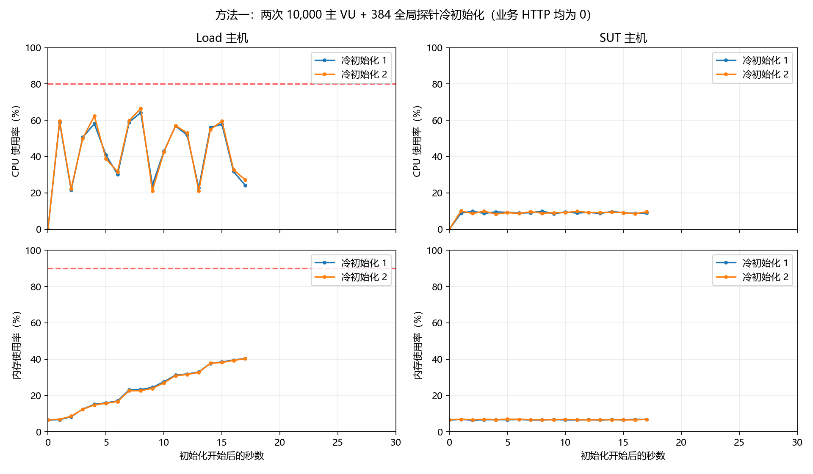
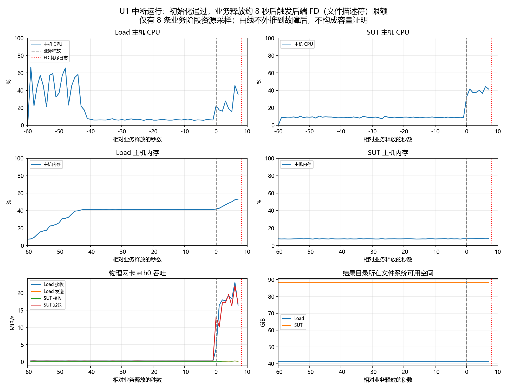

# Phase14 核心正式矩阵结果（2026-09-12）

**Load（压力发生服务器）的万人初始化缺陷已修复并通过连续两次资格验证；正式业务容量仍无结论。** 核心正式 U1 在业务释放约 8 秒后，因 SUT（被测服务器）后端进程的 FD（文件描述符）软限额 1024 耗尽而停止。采样连接随之关闭，运行无效，后续九项核心任务没有启动。本报告不声称完成原 24 项完整矩阵，也不把中断片段判为有效性能失败或容量通过。

## 代码、基线与方法

测量提交为 `9006ee822e557255e244364495fbe251a1a25b18`，tree（Git 目录树对象）为 `fece6ef68aa28d03987d35d09abfc2c8b4487752`。Git（版本控制）正常提交并 push（推送）后，控制端新鲜 fetch（读取官方远端），三端 HEAD（当前提交）与控制端 `origin/main` 一致，工作区干净，领先／落后均为 0/0。Load 从官方 HTTPS 远端同步；SUT 使用控制端校验过 SHA-256（内容摘要）的 bundle（离线 Git 对象包）及单独验证引用快进，没有伪造 SUT 缓存的 `origin/main`。

方法一的实际修改如下：

- `phase14_core.py` 新增核心计划、单实例全局探针、冷初始化资格和十项串行调度。四个主分片只承担主业务，第五个执行单元运行全部低频探针。
- 每类探针仍每秒到达 2 次，按 `2 × 30 秒 × 1.5` 加余量并对齐为 96 个静态 VU（虚拟用户，即 k6 模拟的执行上下文）。四类共 384 个，总初始化量从 25,784 降为 10,384，主业务仍为 10,000。支付请求共享从流程开始计算的 30 秒期限，保留完整业务校验。
- `phase14_initialization.py` 将 30 秒就绪期限与业务释放分开，增加 30 秒中止保护间隔；`phase14_dual.py` 并发停止已核验归属的容器。失败先停止负载再收束采样器，停止异常也保存记录。
- `run_phase14.py`、`phase14_campaign.py` 将新资格证据绑定当前提交；`phase14_startup.py` 和发生器启动入口增加绝对时间保护。原单机／双机默认路径保留；只有 `--core` 选择本轮发生器策略及核心正式计划。
- 用户和认证会话沿用 SharedArray（共享数组），静态座位按编号计算。没有让每个 VU 解析完整身份文件，没有丢弃业务校验所需正文。主用户数、到达率、时长、60% 浏览／25% 占座／15% 下单比例、身份与座位切片、阈值均未修改。支付是另行固定每秒两个模拟流程，不等同于主下单比例，也未调用真实 Stripe 支付。

方法一提交前，Windows 和 Linux 各 **207 项自动化测试通过**，Linux 的 Compose（多容器配置工具）静态验证与 `git diff --check`（差异格式检查）通过。新增测试覆盖默认路径、冻结参数、静态探针分配、唯一全局探针、释放屏障、错误资格证据拒绝和支付期限。生产 `backend/frontend` 代码未修改。计算依据见 [修复设计](phase14_core_design.md)，执行参数见 [核心机器计划](phase14_core_plan.json)；原 [完整计划](phase14_formal_plan.json)保持不变。

**方法二未使用。** 方法一已连续通过初始化资格；随后出现的是 SUT 后端进程限额问题，触发用户规定的安全停止条件。本轮没有修改该限额后重新运行长测试。

## 初始化、G0 与资格结果

| 检查 | 实际结果 |
|---|---|
| 延迟故障夹具 | 最后一个执行单元（全局探针）延迟 31 秒，其余主分片在释放前停止。主业务开始数、支付开始数、HTTP（超文本传输协议）请求数均为 0，数据库指纹不变 |
| 第一次正式冷初始化 | 16.967 秒全部就绪；10,000＋384 VU；Load CPU（处理器）峰值 64.24%，内存 40.41% |
| 第二次正式冷初始化 | 17.094 秒全部就绪；10,000＋384 VU；Load CPU 峰值 66.58%，内存 40.35% |
| 两次共同条件 | 无业务 HTTP、数据库变化、swap（交换空间）增长、OOM（内存耗尽）、重启或采样错误。冷初始化指新容器与新 VU 上下文，没有宣称清空操作系统页缓存 |
| G0（发生器能力校准） | 新提交的四组 ABBA（不启用／启用／启用／不启用详细采样）全部通过；P95、P99 分位延迟增幅均 0%，上限 5% |
| 完整 Smoke（小规模全链路冒烟测试） | **25/25 通过**，另一次证据哈希与采样完整性审计通过 |
| 正式资格门禁 | 通过；主机最大时钟偏差 0.094 毫秒、数据库 0.489 毫秒，阈值 100 毫秒 |
| 数据与镜像 | 1,000,000 用户、100,000 认证会话、2 活动、20 场次、100,000 座位；提交、目录树、镜像、数据指纹均写入运行清单 |
| 正式 U1 自身初始化 | 17.591 秒内五个执行单元全部就绪，初始化缺陷没有复现 |

每个发生器容器仍为原 4 CPU、2 GiB（二进制吉字节）配额。初始化的 HTTP 零值是 k6 业务计数；只读采样、SSH（加密远程连接）和数据库核验仍在运行。故障夹具关闭了只初始化保险逻辑，依靠真实就绪／中止屏障证明其他分片不会释放业务。



## 核心正式场景逐项结果

| 顺序 | 冻结业务场景 | 结果 |
|---|---|---|
| 1 | U1 第一轮，2500→5000→10000 在线用户，1740 秒 | **测量无效**；178 人进入主业务后触发后端 FD 耗尽，没有完成任何在线档位 |
| 2 | U2 第一轮，1740 秒、185000 次独立刷新 | 未运行，安全停止 |
| 3 | O1，10000 条订单写链／60 秒，约 666.67 主链 RPS（每秒请求数） | 未运行，安全停止 |
| 4 | O1，10000 条订单写链／30 秒，约 1333.33 主链 RPS | 未运行，安全停止 |
| 5 | O1，10000 条订单写链／10 秒，4000 主链 RPS | 未运行，安全停止 |
| 6 | H1 临时路径，10000 人竞争 1000 座，每座 10 人 | 未运行，安全停止 |
| 7 | H1 正式路径，同规模 | 未运行，安全停止 |
| 8 | H3 正式路径，10000 人竞争 1 座 | 未运行，安全停止 |
| 9 | L2 背景对照，430 秒 | 未运行，安全停止 |
| 10 | L2 登录，10000 次登录／10 秒，背景窗口 430 秒 | 未运行，安全停止 |

U1/U2 第二轮、J1 三档、E1、H1 两条路径重复轮、H2 两档、H3 临时路径、L1 对照及登录、S1 共 14 项原正式任务不在核心计划内。Smoke 中同名的小数据检查不计作正式场景完成。

## 中断片段的诊断指标

业务释放为 **2026-09-12 00:37:26.725（北京时间）**，最后一条 HTTP 计数距释放约 **8.583 秒**。以下仅描述保留的中断片段；没有把 1740 秒缩短后重新计算通过，也没有补造缺失请求或延迟。

| 指标 | 原始证据统计 |
|---|---:|
| 进入主业务的唯一用户 | 178；主分片周期性 VU 仪表各分片峰值合计 166，采样时刻较早，因此不同 |
| 已记录 HTTP | 1977：主业务 1772，支付 151，三类控制探针各 18 |
| HTTP 状态 | 200：1890；201：43；202：17；无 HTTP 响应（状态 0）：27 |
| 已记录请求的 2xx 比例／无响应比例 | 98.634%／1.366%；不代表完整场景成功率 |
| 中断片段请求完成速率 | 全部约 230.34 RPS，主业务约 206.46 RPS；不是容量上限 |
| 全部 HTTP P50／P95／P99 | 1.327／43.425／54.386 毫秒，由原始 HTTP 延迟样本直接计算 |
| 主业务 HTTP P50／P95／P99 | 1.106／44.221／54.929 毫秒 |
| 主迭代 | 开始 178、完成 0、中断 178；在线迭代包含等待与刷新，不能理解为全部 HTTP 均失败 |
| 支付迭代 | 开始 18、完成 10、中断 8；终态日志为 9 成功、1 异常契约结果 |
| dropped iterations（未能按计划启动的迭代） | 0；但存在中断，因此调度仍不完整 |
| 业务／流程分类事件 | 2360 成功、52 系统错误、1 异常契约；含请求、页面和流程多个层级，不能作为不重复 HTTP 分母 |

HTTP 延迟采用 k6 的 `http_req_duration`（请求发送、等待和接收耗时），不等于整页耗时或用户思考时间。完整业务失败率和 1740 秒吞吐不可计算。178 是发现问题时已进入的人数，不能解释为“系统最多支持 178 人”。

## 连接故障与资源证据

后端日志在释放后约 8.019 秒首次出现 `Too many open files (errno=24)`，位置为 `Acceptor::readCallback`。随后 `/metrics`（应用指标端点）连接关闭，运行器记录 `RemoteDisconnected`（远端未返回响应即断开）。`/proc/1/limits`（后端进程资源限额）确认打开文件软限额 **1024**、硬限额 **524288**，Docker 容器 `Ulimits`（显式资源限额配置）为空。停止后观察到 429 个已打开描述符，没有把事后数值冒充故障瞬间峰值。

采样器原有 `fdExhausted` 检查针对主机总文件表，未覆盖后端进程自身软限额，所以该布尔值仍为 false。必须结合容器状态与后端日志定位。未来重新测试前，需要明确冻结进程限额及相应资格检查；本轮未修改 SUT 限额或生产业务逻辑。

业务阶段保留了 8 条资源采样：Load 主机 CPU 峰值 **45.63%**、内存 **53.18%**；SUT 主机 CPU **44.44%**、内存 **8.01%**。连同初始化，Load CPU 峰值 **66.54%**。未观察到 OOM、重启、交换增长、网卡错误或主机文件表耗尽。Load／SUT 文件系统剩余空间最低约 41.17／88.31 GiB。采样在故障处中断，这些值不能外推为故障后的峰值。



MiB/s 表示每秒二进制兆字节。网络只取物理网卡 eth0，避免重复累加容器虚拟网卡。曲线从初始化开始绘制；前置门禁三条采样与随后轮前准备另有记录，没有跨准备间隔插值。

PostgreSQL（关系数据库）轮前与轮后连接计数均为 6，统计增量有效：提交事务 6111、回滚 0、死锁 0、临时文件增量 0；锁等待、阻塞及事务获取等待采样均为 0。计数包含采样与核验活动，不是纯业务 TPS（每秒事务数）。查询统计、写前日志及输入／输出增量保存在 `postgres-delta.json`，不能从短片段推断数据库极限。

Redis（内存数据服务）峰值约 8.20 MiB、5 个连接，阻塞、拒绝连接、淘汰及错误增量均为 0。整体键命中率约 0.124%，受对大量未占座键的 MGET（一次读取多个键）查询影响，不能等同于业务缓存效率。末次累计命令摘要中 GET（单键读取）P99 约 5.023 微秒，MGET P99 约 1277.951 微秒；它们不是本轮独立重置的延迟分布。现有证据指向后端 FD 限额，没有证明 CPU、PostgreSQL 或 Redis 是业务容量瓶颈。

## 数据一致性与收尾

原始核验的 14 项全局不变量全部为 0，未发现超卖、重复有效所有者或订单／座位状态破坏。原始支付核验为 17 订单、16 已支付、1 尚未满足终态检查；停止后新建审计目录复核，17 笔均正确已支付，异常终态为 0，主业务 2 笔订单的用户、预订与座位数量一致，结账逻辑身份错配为 0。正式登录场景未运行，不能宣称其身份正确性已通过正式验证。

**原运行整体对账仍失败并保留失败状态。** 数据库最终 17 笔支付与原始成功终态日志 9 笔不相等，因为停止中断了观察流程；没有覆盖原报告或刷新旧资格。

专属服务从 **2026-09-11 23:36:50.554** 到 **2026-09-12 00:43:01.904** 运行约 **1 小时 6 分 11 秒**，因安全条件提前结束，未触及 4 小时上限。SUT 六个容器和 Load 1057 个历史／本轮容器均停止并保留；两个 SUT 数据卷、镜像和全部历史证据保留。SUT 本轮公钥授权已删除；负向认证检查确认无法登录后，Load 专用私钥、公钥文件、专用主机记录及配置块已删除。其他 SSH 授权保留，密钥内容没有进入证据。

**停止容器不会停止 ECS（云服务器）计费。请按实例购买方式手动停止或释放两台 ECS。**

## 证据索引与准确命令

服务端证据根目录为 `/srv/phase14/repo/performance/results/`：

- 初始化资格：`phase14-formal-init-only-20260911T154039Z-c7bb97`。
- G0：`phase14-formal-run-20260911T154259Z-1bdd48`。
- Smoke：`phase14-smoke-campaign-20260911T154821Z-7afd20`。
- 正式资格：`phase14-formal-qualify-20260911T162841Z-910b33`。
- 核心批次：`phase14-formal-campaign-20260911T162913Z-43fabf`。
- U1：`phase14-formal-u1-20260911T162929Z-f5cc8a`。
- 停止审计：`phase14-formal-core-stop-audit-20260911T164011Z-125b9e`。
- 服务收尾：`phase14-formal-core-shutdown-20260911T164240Z-e64444`。

控制端归集 358 个文件，位于 Git 忽略目录 `performance/results/phase14-core-analysis/round/`；另保存两次初始化与故障夹具原始证据。归集压缩包 SHA-256 为 `13d773cd89ee9df938f86846290eca3000a09fa49aec5c3f9cd4bb868cca435b`。原始 JSON（结构化数据）指标、压缩校验、采样、数据库核验、Prometheus（指标时序存储）查询、运行清单和停止记录仍在服务器；六项服务日志已脱敏压缩保存。Git 只收录工具、测试、计划、本报告、[结构化结果](phase14_core_results.json)和曲线。

实际正式启动命令如下。该命令绑定本轮专用停止时间和已关闭的环境，临时 SSH 已撤销，因此这是审计记录，不能直接复用为新的运行：

```sh
python3 -u performance/scripts/run_phase14.py campaign \
  --shards 4 \
  --qualification /srv/phase14/repo/performance/results/phase14-formal-qualify-20260911T162841Z-910b33/qualification.json \
  --formal-approved --core --deadline-at 1789154810.5539405 \
  --topology-config /srv/phase14/runtime/dual-host.json --yes
```

已证明的范围是万人 VU 初始化稳定在 30 秒内完成、零流量中止屏障有效、新提交 G0 与完整 Smoke 资格通过。没有证明 2500、5000 或 10000 在线用户的正式稳定容量，也没有获得其他核心场景的正式容量边界。
