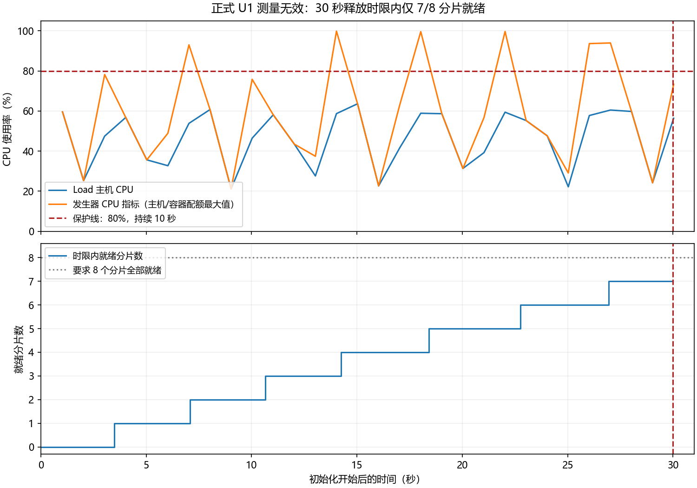

# Phase14 双机执行结果与停止报告

**结论：双机适配、G0（负载发生器能力校准）、完整 Smoke（小规模全链路冒烟）和正式资格门禁已完成；正式 U1 因初始化超时而测量无效，后续 23 项未执行。当前不能得出万人业务容量通过或失败的结论。**

测试日期为 2026-09-11。下文时间使用 UTC（协调世界时），北京时间需加 8 小时。完整数值方案见 [双机执行方案](phase14_dual_host_implementation.md)，冻结 24 项计划见 [机器可读计划](phase14_formal_plan.json)，逐项结果见 [结果数据](phase14_dual_host_results.json)。

## 不可变基线与实际适配

实测提交为 `59d56981a43acdefeb6cdf0b2b8e822037940df1`，tree（目录树对象）为 `e889da3d48d26bcbc8f525fc2f65eb69663cb627`。targets（冻结参数文件）的 SHA-256（内容校验值）为 `653bbcf69399ef14f822e2ff4235332384062743072b93e3763632673a5b35b8`。报告提交可能晚于实测提交，不能把文档提交标作测试版本。

控制端重新从官方 HTTPS（经过证书校验的加密 HTTP）origin 获取 main；Load（负载服务器）直接读取官方仓库；SUT（被测服务器）仍不能独立访问 GitHub，采用控制端新鲜 fetch（读取远端对象）加 SHA-256 校验的 git bundle（离线对象包）、严格 SSH（加密远程执行协议）传输和 fast-forward（仅向前合并）同步。SUT 的旧 origin/main 未伪造，验证引用单独保存。正式启动前，三端 HEAD（当前提交）、目录树、干净工作区和对应基线领先/落后 0/0 均一致。

双机适配增加角色隔离、私网业务绑定、受限 Load→SUT 通道、精确容器身份保护、双端独立采样、快照及数据指纹、资格与证据哈希绑定、串行场景执行和停止归集。修复了 SSH 建连耗时污染时钟、Docker（容器引擎）统计采样慢、退出分片统计竞争、历史容器影响采样、G0 响应服务文件描述符不足、初始化调度和数据库旧语句统计累积。没有修改 backend/frontend（生产后端/前端）业务代码或冻结 targets。

PostgreSQL（关系型数据库）的语句统计在每轮恢复后先完整归档，再仅清理专属数据库的计数。业务测量期间出现计数重置或淘汰仍判无效；没有提高统计容量或放宽判定。网络修复只更正两台 origin，控制端最近一次证书后端兼容问题采用单次 OpenSSL 参数，未关闭 TLS（传输层安全）验证或写入令牌。

## 测试与资格

| 项目 | 实际结果 |
|---|---|
| Windows 实测代码自动化测试 | 195 项通过 |
| Load/Linux 实测代码自动化测试 | 195 项通过 |
| 最终交付验证 | Windows 与 Linux 各 199 项通过，含报告与证据一致性检查 |
| Compose（容器编排）原始与双角色配置 | 校验通过，SUT 六个专属服务，Load 独立项目 |
| 数据 | 1,000,000 用户；100,000 有效认证会话；2 活动；20 场次；100,000 座位 |
| reset（恢复基线） | 完整 Smoke 各轮及正式轮快照哈希、所有表指纹一致，Redis（内存键值数据库）恢复后为 0 |
| 正式 G0 | 固定四轮 ABBA（关、开、开、关详细采样）均通过；P95/P99 开销增长均为 0%，阈值仍为 5% |
| Smoke | 同提交完整 25/25 通过；原始证据哈希与角色采样二次审计通过 |
| 时钟 | 主机偏差最大约 0.27 毫秒；数据库约 0.87 毫秒，均低于 100 毫秒 |
| Prometheus（指标时序数据库） | backend、postgres、redis 三个采集目标均 up（正常） |

G0 目录：`phase14-formal-run-20260911T134816Z-31b53a`。Smoke 目录：`phase14-smoke-campaign-20260911T135124Z-ee5a9a`。正式资格：`phase14-formal-qualify-20260911T142019Z-39cc2f/qualification.json`。这些编号均相对于 Load 的 `/srv/phase14/repo/performance/results/`。

## 正式停止原因与有效性

正式 Campaign（测试批次）为 `phase14-formal-campaign-20260911T142045Z-ae28a5`，首轮 Run ID（运行编号）为 `phase14-formal-u1-20260911T142059Z-221cb5`。运行器先完成正式数据恢复、认证校准和身份预热，随后尝试初始化 10,000 个主 VU（虚拟用户）及 15,784 个探针预分配 VU，共 25,784 个执行单元。预分配不等于同时发请求；健康、认证、余票探针仍各每秒 2 次，模拟支付仍每秒 2 个流程。

30 秒冻结释放时限内只有 7/8 个分片就绪。最后一个分片日志在 14:28:22 才出现就绪标记，释放点为 14:28:20.952；日志只有秒级精度，因此这里只能确认其晚于释放点，不伪造毫秒级延迟。运行器按无效测量停止，没有延后释放点、降低虚拟用户数、缩短业务时长或跳过 U1 进入后续场景。



初始化期主机 CPU（处理器）峰值约为 Load 63.6%、SUT 22.6%；Load 主机内存峰值约 79.7%。发生器 CPU 指标峰值 99.85%、内存指标峰值 85.00%，它们取主机与各 k6（负载工具）容器相对配额的最大值，不能混同为整台主机资源使用率。每个分片仍为 4 CPU、2 GiB（每 GiB 为 2³⁰ 字节）配额。此轮未观察到交换、OOM（内存不足终止）、网络错误或服务重启。直接停止原因是初始化时限，而非业务服务器达到容量边界。

停止时已经就绪的分片按共同释放点短暂发出了业务请求，依次停止容器也需要时间。记录到主旅程开始 60、完成 0、中断 60；支付流程开始 18、日志完成 8、中断 10；dropped iterations（未能按计划启动的迭代）为 0。零 dropped 不能抵消不完整投递和中断。最后一个资源样本约在释放后 0.030 秒，因此停止过程的短暂业务片段不具备完整资源覆盖，不能用其中的吞吐或延迟作容量结论。

本轮原始正确性文件保留为失败：核验当时 18 笔支付中 17 笔已支付。停止后独立只读审计发现 18 笔均已支付、终态非法数量为 0，14 项全局不变量全部为 0。最终审计的整体对账仍为失败，因为数据库 18 笔与中断日志的 8 次完成不相等；没有把最终状态正常改写成“完整运行通过”。未发现超卖、身份串用、重复有效所有者或订单状态破坏。

## Smoke 逐项实测

下表仅描述小规模功能验证，不适用于万人容量。HTTP（超文本传输协议）成功率采用 k6 的请求失败标记；热点的预期冲突会降低 HTTP 成功率，但仍是正确业务竞争结果。RPS（每秒请求数）按首个到末个请求的实测时间跨度计算，包含探针；短窗口会有边界效应。P50/P95/P99（50%/95%/99% 样本不超过的延迟）由全部分片原始点重算，单位为毫秒。详细分步骤业务成功、冲突、拒绝和系统错误分类保留在原始全局汇总及机器可读结果中。

| 序号/场景 | 参数 | HTTP 成功率 | 实测 RPS | P50 / P95 / P99 | 功能 |
|---|---|---:|---:|---|---|
| 1 / G0 | `{}` | 100.00% | 21.07 | 0.11 / 0.21 / 0.23 | 通过 |
| 2 / U1 | `{"round": 0}` | 100.00% | 41.73 | 1.02 / 4.26 / 8.35 | 通过 |
| 3 / U1 | `{"round": 1}` | 100.00% | 40.87 | 1.03 / 4.51 / 7.85 | 通过 |
| 4 / U2 | `{"round": 0}` | 100.00% | 42.25 | 1.01 / 3.85 / 7.38 | 通过 |
| 5 / U2 | `{"round": 1}` | 100.00% | 42.25 | 1.01 / 4.50 / 7.33 | 通过 |
| 6 / J1 | `{"window": 0}` | 100.00% | 41.30 | 1.16 / 5.42 / 10.23 | 通过 |
| 7 / J1 | `{"window": 1}` | 100.00% | 46.34 | 1.26 / 5.75 / 7.74 | 通过 |
| 8 / J1 | `{"window": 2}` | 100.00% | 52.60 | 1.20 / 5.38 / 7.52 | 通过 |
| 9 / O1 | `{"window": 0}` | 100.00% | 24.38 | 1.49 / 6.56 / 8.97 | 通过 |
| 10 / O1 | `{"window": 1}` | 100.00% | 22.58 | 1.68 / 5.76 / 10.67 | 通过 |
| 11 / O1 | `{"window": 2}` | 100.00% | 22.15 | 1.69 / 5.97 / 9.74 | 通过 |
| 12 / E1 | `{}` | — | — | — / — / — | 通过 |
| 13 / H1 | `{"path": "temporary", "repeat": 0}` | 73.53% | 9.06 | 1.25 / 4.46 / 5.77 | 通过 |
| 14 / H1 | `{"path": "temporary", "repeat": 1}` | 73.53% | 9.06 | 1.20 / 3.19 / 4.99 | 通过 |
| 15 / H1 | `{"path": "formal", "repeat": 0}` | 73.53% | 9.06 | 1.59 / 4.71 / 7.69 | 通过 |
| 16 / H1 | `{"path": "formal", "repeat": 1}` | 73.53% | 9.06 | 1.56 / 5.63 / 7.27 | 通过 |
| 17 / H2 | `{"session_count": 10}` | 73.53% | 9.06 | 1.45 / 3.85 / 7.20 | 通过 |
| 18 / H2 | `{"session_count": 20}` | 73.53% | 9.07 | 1.43 / 4.88 / 6.38 | 通过 |
| 19 / H3 | `{"path": "temporary"}` | 72.06% | 9.07 | 1.68 / 8.08 / 8.25 | 通过 |
| 20 / H3 | `{"path": "formal"}` | 72.06% | 9.07 | 1.54 / 16.45 / 17.47 | 通过 |
| 21 / L1 | `{"control_only": true}` | 100.00% | 40.14 | 1.35 / 4.66 / 6.77 | 通过 |
| 22 / L1 | `{"control_only": false}` | 100.00% | 41.11 | 1.47 / 5.93 / 108.96 | 通过 |
| 23 / L2 | `{"control_only": true}` | 100.00% | 36.41 | 1.39 / 5.00 / 7.09 | 通过 |
| 24 / L2 | `{"control_only": false}` | 100.00% | 39.14 | 1.43 / 6.16 / 112.41 | 通过 |
| 25 / S1 | `{}` | 100.00% | 26.17 | 1.80 / 19.10 / 23.26 | 通过 |

E1（过期释放）的 Smoke 使用 20 笔夹具，约 4.714 秒排空，剩余 0；这不是正式一万笔到期释放的结果。S1（稳定性）的 Smoke 也仅为冻结缩小窗口，不能证明正式 1,800 秒稳定性。

## 正式矩阵覆盖与后续边界

正式 U1 第一轮为测量无效，其余 23 项全部未执行：U1 第二轮、U2 两轮、J1 三档、O1 三档、E1、H1 四轮、H2 两档、H3 两路径、L1/L2 各对照与登录、S1。机器可读结果逐项标为 `not_run_after_stop`（停止后未运行）。没有有效性能失败样本，也没有建立服务端最大吞吐或万人容量边界。

本次证明的是：当前启动调度、分片配额和冻结 30 秒释放契约的组合未通过初始化资格。若后续继续，需要先在新提交上证明初始化策略同时满足原时限与资源保护，再从 G0、完整 Smoke 和正式资格重新开始。不能把本次结果直接用作扩容依据，也不能重复执行并挑选偶然赶上时限的一次。

## 历史失败与修复记录

| 提交 | 修改/证据 |
|---|---|
| d1c67a8 | 首次双机隔离、恢复、采样和正式资格适配 |
| b44e440 | 排除 SSH 建连对时钟与采样的污染 |
| 41e6d06 | 单次容器引擎统计，资格绑定分片数 |
| 06cf94a | 原 G0 因响应服务文件描述符不足失败，增加专属 noop 的描述符能力 |
| f9580d1 | 分片正常退出时二次核验，避免把空统计误报为活跃容器错误 |
| 780b47b | 正式准备发现采样间隔与 G0 不同，停止后统一为冻结 1 秒 |
| 45d4de9 | 采样排除历史已停止 Load 分片，保留其证据 |
| 4dc32c2 | 并行初始化触发发生器 CPU 保护，改为正式串行就绪与持续采样 |
| 7d4d3a1 | 小规模 Smoke 串行初始化超过 8 秒，恢复小规模并行；业务释放预算在准备完成后设置 |
| 59d5698 | 原 U1 Smoke 因旧语句统计淘汰无效，恢复后先归档再清理专属统计；195 项测试通过 |

历史目录均保留。关键失败包括 `phase14-formal-g0-20260911T110120Z-56143e`、`phase14-smoke-u1-20260911T111429Z-82a964`、`phase14-formal-campaign-20260911T115321Z-6a3268`、`phase14-formal-run-20260911T120049Z-f83ce6`、`phase14-formal-u1-20260911T124320Z-13c5b4`、`phase14-smoke-l1-20260911T132838Z-005219` 和 `phase14-smoke-u1-20260911T134352Z-a4fac6`。旧提交的通过结果没有充作当前资格。

## 执行命令、时长和证据

实际正式命令在 Load 的 `/srv/phase14/repo` 执行：

```sh
python3 -u performance/scripts/run_phase14.py campaign --shards 4 --qualification /srv/phase14/repo/performance/results/phase14-formal-qualify-20260911T142019Z-39cc2f/qualification.json --formal-approved --topology-config /srv/phase14/runtime/dual-host.json --yes
```

实际加载的运行清单目录为 `phase14-formal-launch-20260911T142030Z-932811`，其中 `plan.json`、`run-manifest.json` 保存精确计划及脱敏清单；真实双机地址仅在服务器 0600 权限的 `run-manifest.private.json` 中。

冻结业务窗口上界为 10,440 秒（2.900 小时）；含恢复、释放等待与执行器宽限的计划上界为 20,813 秒（5.781 小时），此外还有轮前恢复、校准和预热。本次正式批次约在 14:20:45 建立、14:28 后触发停止，未完成上述计划时长；精确业务片段只能作为无效诊断。费用按用户要求不统计。

Load 的 `/srv/phase14/repo/performance/results/` 保存每轮原始 k6 日志、压缩原始点及哈希、spec/manifest（执行参数/运行清单）、全局分位数、双机资源、PostgreSQL 前后与增量、Redis INFO（服务统计）、Prometheus 查询、恢复和停止记录。最终只读审计目录为 `phase14-formal-final-audit-20260911T143008Z-060336`。

SUT 的 `/srv/phase14/runtime/final-service-evidence-20260911T1433Z/` 保存六个专属服务的脱敏日志及容器状态。慢查询证据是语句执行聚合统计，不是逐条 SQL（数据库查询语言）文本日志；采样缺失区间与未运行场景没有补造指标。

Git（版本控制系统）只提交源码、测试、执行方案、脱敏汇总和本报告图表。大体积原始点、日志、快照、合成认证输入、运行时地址配置和私有清单不进入 Git，控制端分析副本位于忽略目录 `performance/results/phase14-control-analysis/`。

## 安全收尾

报告首批提交 `ca744f5` 正常 push 后，已停止全部 Phase14 专属服务。SUT 的 6 个容器、Load 的 898 个当前及历史容器均保留，运行数量均为 0；镜像、两个 SUT 命名数据卷和所有历史证据保留。停止接口首次因未显式列出服务名称而拒绝，未改变服务状态；随后按既有白名单显式停止六个 SUT 服务和 Load 的 noop，失败尝试另有独立记录。

SUT 专用公钥授权已删除，并在 Load 仍持有密钥时验证登录被拒绝；随后删除 Load 专用私钥、公钥文件、专用主机记录和配置块，其他 SSH 授权与控制端访问不变。密钥没有进入 Git、镜像、日志或报告。

收尾证明位于 Load 的 `/srv/phase14/repo/performance/results/phase14-formal-shutdown-20260911T144230Z-e2464d/`，分别保存 `shutdown.json` 和 `ssh-cleanup.json`；SUT 另有 `/srv/phase14/runtime/ssh-cleanup.json`。环境保留区间从首个专属容器创建的 10:44:31 到最终服务停止的 14:42:35，约 **3 小时 58 分 4 秒**，其中包含修复、重跑和恢复停机时间，不能等同于有效正式压测时长。
