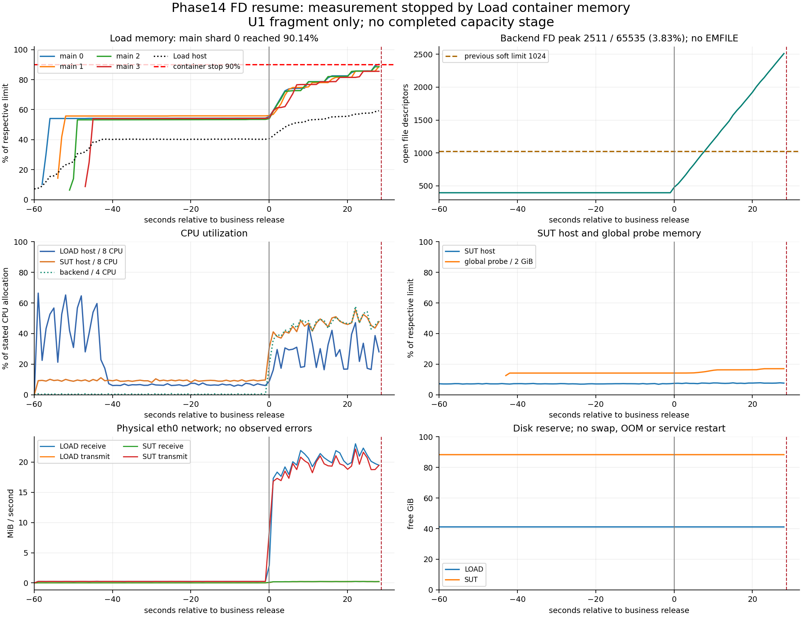

# Phase14 FD 修复与核心正式矩阵续测结果

**后端 FD（文件描述符）限额修复生效，但核心正式矩阵未完成，不能据此评价 SUT（被测服务器）的万人容量。** U1 业务释放后约 28.68 秒，Load（压力发生服务器）的一个主业务分片达到其 2 GiB 容器内存限额的 90.14%，触发冻结的发生器资源保护。该轮属于测量无效，后续九项未运行。没有提高内存限额、减少用户、改变阈值或重复高负载以争取通过。

本报告保留上一轮“1024 软限额耗尽、约 8 秒中断”的结论，并新增本轮独立证据。上一轮报告见 [核心正式矩阵报告](phase14_core_results.md)，本轮结构化数据见 [结果 JSON（机器可读数据）](phase14_fd_resume_results.json)。本轮不代表原 24 项完整矩阵完成。

## 1. 修复、配置与源代码

| 项目 | 修复前 | 本轮实测 |
|---|---:|---:|
| backend 服务主进程 nofile（打开文件描述符限额），软/硬 | 1024 / 524288 | 65535 / 65535 |
| Docker inspect（容器配置检查） | 未配置服务级限额 | nofile=65535/65535 |
| 本轮运行 FD 峰值 | 不适用 | 2511，占软限额 3.8315% |
| EMFILE（文件描述符耗尽）及相关接收错误 | 上轮有 | 本轮未发现 |
| 修复方法 | — | 首选 Compose 配置并重建，一次成功；第二种方法未使用 |

仅 backend 服务新增限额。宿主内核、Docker 守护进程默认值、数据库连接池、Redis（内存键值存储）、Load 配额和生产业务代码均未调整。原 noop（空操作校准服务）的 16384 限额保持不变。

测量时由原 Compose（多容器配置）生成 SUT 角色配置，再叠加只含 backend nofile 的运行覆盖配置。所有恢复、创建和重启均使用该生成路径，并真正重新创建后端容器。后端主进程的 `/proc` 限额和 Docker 配置均通过核验。实际覆盖文件为：

```json
{"services":{"backend":{"ulimits":{"nofile":{"soft":65535,"hard":65535}}}}}
```

增量资格记录同时绑定原角色配置、覆盖文件和最终渲染配置的 SHA-256（内容摘要）：

| 文件 | SHA-256 |
|---|---|
| fd-original-role-compose.json | `75f14e990d211f2bb80af9a2242f304a33b4e61628fbb51aae76e87a3e82df36` |
| fd-override.json | `52cd400a0ddda4aee21ecd4c6f5ce8182fe898a575fe17d875f9d731871ce408` |
| fd-rendered-role-compose.json | `45dcbda79b9bd5b1fdc230653eae0b585a44370daab8a00ecc1bdda703cb28a4` |

原始 YAML（结构化配置文本）来源固定于测量提交；其内容摘要及三份配置的脱敏副本保存在 [配置证据](phase14_fd_compose_redacted.json)。脱敏副本仅用于审核，不可直接部署。源配置摘要由不可变提交对象重新计算，与运行时生成配置的原始摘要分开记录。

新增 `phase14_fd.py` 负责限额契约、覆盖配置、85% 连续三个采样点的停止判定及原资格与增量资格绑定。双机采样从已验证容器的宿主主进程编号读取 `/proc/<PID>/fd` 和 `limits`，记录数量、限额、比例、容器启动时间，以及最近五秒日志中的相关错误时间点。重复时间点需去重，不能直接累加重叠窗口。FD 证据先独立落盘，再等待后端 HTTP（超文本传输协议）指标响应，因此指标接口断开不会抹掉已采集的 FD 证据。

正式测量提交为 `a169350b5ec61a6f9f077a80e7af7bfeca92d239`，目录树为 `5e35ee9caed3300b2f4520cd616bc9103fc49580`。运行前官方远端读取、控制端、SUT、Load 的提交和目录树一致，三个主工作区干净。SUT 使用可信控制端新鲜 fetch（读取官方远端）和 SHA-256 校验 bundle（离线 Git 对象包）建立独立验证引用并正常快进；没有伪造其缓存的 origin/main。

测量结束后，提交 `ef5d8638a84d3ecca28c38ad81b039c59f9c85e2` 将完全相同的限额写回 `performance/docker-compose.phase14.yml` 并加入小型配置契约测试。它不是本轮测量提交，不追溯改变原始记录。

## 2. 复用的资格与本轮新增检查

原资格测量提交为 `9006ee822e557255e244364495fbe251a1a25b18`。下列已通过证据仅校验原文件摘要及绑定关系，**没有重跑，也没有复制伪装成新运行**：

| 复用项目 | 原 Run ID（运行编号） |
|---|---|
| 连续两次冷初始化 | `phase14-formal-init-only-20260911T154039Z-c7bb97` |
| G0（发生器能力校准），四组 ABBA（关闭/开启采样交叉对照） | `phase14-formal-run-20260911T154259Z-1bdd48` |
| 完整 Smoke（小规模冒烟测试）25/25 | `phase14-smoke-campaign-20260911T154821Z-7afd20` |
| 正式资格记录 | `phase14-formal-qualify-20260911T162841Z-910b33` |

原故障夹具与已通过全量测试仍作为既有证据，不再执行。新记录类型明确为 `phase14-fd-delta`，保留原资格路径、原提交、原文件摘要及被引用运行摘要；同时核对新提交的受审计文件差异，保持负载脚本、targets（冻结目标参数）、身份文件、数据快照、镜像和双机拓扑绑定不变。

本轮新增检查：

- Windows 和 Linux 在测量前各通过 32 项定向测试，未重跑全量 207 项测试。
- 新渲染 Compose 检查通过，后端实际进程及 Docker 的软硬限额均为 65535。
- 短连接检查使用 10 个并发连接完成 100 次健康请求，耗时 0.511 秒，全部通过；这不是容量测试。
- 两台主机时间同步正常，主机对时最大绝对偏差 0.3632 毫秒，数据库对时 0.2702 毫秒，均小于原 100 毫秒门限。
- 当前资源、磁盘、交换空间、网络、Prometheus（指标时序存储）采集和全局数据库不变量检查通过。
- 百万用户、十万认证会话的输入及数据快照摘要、后端镜像和 Load 镜像与旧资格一致。
- 新增量资格为 `phase14-formal-fd-delta-20260911T172521Z-b5ed15`；独立即时复核通过。
- 标准配置写回后，Windows 的 6 项配置/FD 契约测试通过；Linux 的 33 项直接相关测试及 Compose 渲染通过。测试夹具曾误计入原 noop 限额、独立 Linux 验证命令曾被 sudo 过滤环境变量，均在交付验证阶段修正；这些不是正式 Campaign（测试批次）重试。
- 最终报告与结构化结果的三项交叉一致性检查在 Windows、Linux 均通过。

U1 本次正式运行的五个执行单元在 17.598 秒内完成自身就绪。这是本次正式运行的一部分，不是重新执行两次独立初始化资格探针。

## 3. 十项核心正式场景逐项状态

所有用户数、身份切片、请求计划、行为比例、支付模拟语义及门限沿用冻结核心计划。主业务仍预分配 10000 个 VU（虚拟用户），四个主分片配合一个全局探针进程；支付模拟仍为每秒 2 个流程，健康、认证、余票探针各每秒 2 次。

| 顺序 | 冻结场景 | 本轮状态 | 说明 |
|---:|---|---|---|
| 1 | U1 第一轮，2500→5000→10000，1740 秒 | **测量无效** | 约 28.68 秒触发 Load 容器内存保护，未完成任何稳定档位 |
| 2 | U2 第一轮，1740 秒、185000 次独立刷新 | 未运行 | 全局停止 |
| 3 | O1，10000 条订单写链，60 秒 | 未运行 | 全局停止 |
| 4 | O1，10000 条订单写链，30 秒 | 未运行 | 全局停止 |
| 5 | O1，10000 条订单写链，10 秒 | 未运行 | 全局停止 |
| 6 | H1 临时占座，10000 人竞争 1000 座 | 未运行 | 无赢家/冲突数量的正式结论 |
| 7 | H1 正式预订，相同规模 | 未运行 | 无原子性容量结论 |
| 8 | H3 正式预订，10000 人竞争 1 座 | 未运行 | 未验证精确 1 成功、9999 指定冲突 |
| 9 | L2 背景对照，430 秒 | 未运行 | 前置 U1/U2 万人通过条件也未建立 |
| 10 | L2 登录洪峰，10000 次/10 秒，背景窗口 430 秒 | 未运行 | 无登录容量或背景影响结论 |

没有有效性能失败或正式通过项。U1 第二轮、U2 第二轮、J1 三档、E1、H1 两条路径的重复轮、H2 两档、H3 临时路径、L1 对照和登录、S1 共 14 个原完整矩阵项目仍排除，未补跑。

## 4. U1 中断片段的诊断数据

本节仅描述已观察片段，**不能当作完整业务窗口吞吐、业务失败率或容量边界**。记录了 597 名主用户进入，不能解读为系统容量只有或已稳定支持 597 人。10000 个已初始化 VU 不等于 10000 个实际同时活跃用户。

| 观察范围 | HTTP 请求数 | 片段平均 RPS（每秒请求数） | P50 / P95 / P99（第50/95/99百分位）延迟，毫秒 |
|---|---:|---:|---|
| 全部已记录请求 | 7538 | 262.85 | 1.917 / 47.764 / 59.304 |
| 主业务请求 | 6788 | 236.70 | 1.680 / 48.158 / 59.795 |

计算区间从业务统一释放到最后 HTTP 点，共 28.6775 秒；延迟从全部原始请求观察计算，没有平均分片百分位。HTTP 请求耗时不包含用户思考和完整页面业务流程时间。

已记录响应均为 2xx：200 为 7232 次、201 为 248 次、202 为 58 次，记录内 HTTP 错误为 0。另有 9266 个成功业务分类事件，这些包含请求、页面、完整流程等多层统计，不能作为互斥请求分母。中断的请求/流程没有完整终态，因此不能据此声称业务失败率为 0。

主迭代开始 597、完成 0、被中断 597；三个控制探针各开始并完成 58 次。支付开始 58、完成 51、被中断 7。dropped iterations（未能按计划启动的迭代）为 0，但原计划交付及终态守恒不完整，故仍为测量无效。退出码 105/137 出现在保护终止过程中；Docker 的 OOM（内存耗尽杀进程）标记均为 false，不能把 137 单独解释为实际 OOM。

## 5. 资源与瓶颈证据



图中 0 为业务释放时刻，红色竖线为最后请求附近的停止点。只绘制初始化及业务期间的真实采样，不对停止后的空白区间外推。负载机、被测机分别对应图中的 Load、SUT；图中 CPU 为处理器利用率，GiB/MiB 为二进制容量单位，eth0 为物理网络接口。

| 业务期间指标 | Load | SUT |
|---|---:|---:|
| 宿主 CPU 峰值 | 47.12% | 55.65% |
| 宿主内存峰值 | 59.25% | 7.84% |
| 最小可用磁盘 | 41.11 GiB | 88.32 GiB |
| 交换增长、OOM、服务重启、网络错误 | 未观察到 | 未观察到 |

直接停止依据是主分片 0 的容器工作内存达到 90.1423%，不是 Load 宿主内存达到 90%。该容器上限为 2147483648 字节，采样原始使用量 1940971520 字节；按原采样器扣除 inactive_file（非活跃文件缓存）5181440 字节后，工作内存为 1935790080 字节。同一时刻另外三个主分片约为 88.75%、88.57%、85.56%，全局探针约 17.04%。这说明首先遇到的是当前发生器容器配置下的内存安全边界；不能据此证明 Load 整机硬件不足，也没有足够证据断言具体对象泄漏。

没有定位到 FD 部署未落地或内存采样计算错误。进一步修改发生器配额或内存实现，需要独立的诊断及带实际响应的资格证明，不能继续沿用本轮“仅后端 FD 环境变化”的增量资格。本轮未进行该类优化，也未盲目使用一次无效结果重试机会。

后端进程 FD 峰值只占新软限额 3.83%，未触发 85% 连续三点保护。后端容器相对其 4 CPU 配额的峰值约 57.72%。事务等待数、最长事务获取等待、锁等待、阻塞、密码哈希队列和座位计算队列的采样峰值均为 0，未形成服务端饱和结论。

PostgreSQL（关系数据库）的前后连接数均为 6；统计增量中提交 15852、回滚 0、死锁 0、临时文件 0。提交数包含观测/审计，不能直接作为业务事务吞吐。执行总耗时最高的语句标识 `8134710093968320007` 调用 936 次、返回 4680000 行、总执行耗时 9461.30 毫秒；另一个标识 `5341900767740232231` 调用 597 次、返回 2985000 行、耗时 7146.08 毫秒。它们显示座位数据查询的工作量，但短片段不能确定数据库容量边界。

Redis 内存峰值约 7.98 MiB、连接峰值 6、阻塞客户端 0、瞬时操作率峰值 764/s；拒绝连接、淘汰和错误回复增量均为 0。命中/未命中增量为 8002/4624023，大量尚未占用座位的批量键读取会产生未命中，不能只凭约 0.173% 的比率认定缓存失效。最后采样的累计 GET（单键读取）P99 为 5.023 微秒、MGET（批量读取）P99 为 1441.791 微秒，这些不是严格按本轮重置的请求百分位。

## 6. 数据正确性与停止后的核验

本轮原始对账和停止后独立复核均保留。14 项全局不变量全部为 0：未观察到超卖、重复有效所有者、订单/座位状态错误或身份归属错误。主业务产生 57 份订单、57 名用户及 57 份预订，错误座位数量 0；占座归属不匹配为 0。

支付数据库有 58 份订单且均已支付、无异常终态，而原始日志只记录 51 次支付终态成功，另 7 次流程在保护停止时中断。因此整体 `payment terminal reconciliation failed`（支付终态对账失败）仍为失败，不能用后续数据库已经完成支付来刷新或覆盖旧结果。该证据支持中断导致终态观测不完整，不等于发现 7 笔数据库状态破坏。

触发资源保护和对账停止后，没有再次恢复数据库或启动下一个高负载场景。现场数据被保留以便后续审计。

## 7. 执行记录、证据与收尾

本轮实际命令已保存在运行清单中，主要参数如下；这是历史执行记录，已关闭环境且凭据已撤销，不应直接重放旧资格：

```sh
python3 -u performance/scripts/run_phase14.py campaign --core --shards 4 \
  --qualification /srv/phase14/repo/performance/results/phase14-formal-qualify-20260911T162841Z-910b33/qualification.json \
  --delta-qualification /srv/phase14/repo/performance/results/phase14-formal-fd-delta-20260911T172521Z-b5ed15/delta-qualification.json \
  --deadline-at 1789167600.8098903 \
  --topology-config /srv/phase14/runtime/dual-host.json --formal-approved --yes
```

用户后续将三小时上限改为六小时左右，并允许无异常的正常慢进度延时。本轮因安全停止提前结束，没有使用延时。服务启动时间为北京时间 2026-09-12 01:25:00.810，全部停止时间为 01:38:42.641，实际占用 821.83 秒，即约 13 分 42 秒。

所有运行证据根目录为 Load 上 `/srv/phase14/repo/performance/results/`：

| 证据 | 目录 |
|---|---|
| 部署、配置摘要、短连接、新快速检查和完整收尾 | `phase14-formal-fd-deploy-20260911T172454Z-c10108` |
| 增量资格 | `phase14-formal-fd-delta-20260911T172521Z-b5ed15` |
| 计划与运行清单 | `phase14-formal-fd-launch-20260911T172657Z-4198cb` |
| 十项状态账本 | `phase14-formal-campaign-20260911T172657Z-46a735` |
| U1 原始分片日志、指标、FD 曲线、数据库核验 | `phase14-formal-u1-20260911T172711Z-f6fa49` |
| 停止后的独立资源和数据审计 | `phase14-formal-fd-stop-audit-20260911T173735Z-c42d93` |
| 脱敏服务日志、最终指纹和停机核验 | `phase14-formal-fd-shutdown-20260911T173821Z-ed1b4a` |

控制端归集目录为 `performance/results/phase14-fd-analysis/round/`，归集 209 个文件，压缩包 2090163 字节，SHA-256 为 `8e7c6c87ab4d226a8b8cf0aad1efc2cbbdbf77f4ad77482b0cb5d06d2226e4f8`。原始 `raw.json`（逐请求指标流）、压缩原始指标、采样、命令日志及服务证据保留在服务器；原始大文件不进入 Git（版本管理仓库）。报告、结构化结果、曲线、工具和契约测试进入 Git。

SUT 保留 6 个专属容器，Load 保留 1062 个本轮及历史容器，二者均为零运行；两个 SUT 数据卷和所有镜像保留。Load 专用 SSH（加密远程连接）私钥、公钥副本、主机记录及配置块已删除，SUT 的对应公钥授权已撤销，撤销后认证失败检查通过，其他授权保持不变。密钥从未作为测试证据归集。

**停止容器不等于停止云服务器计费。请按实例购买方式手动停止或释放 ECS（云服务器实例）。**

本轮可证明 FD 部署修复和停止保护有效，并揭示当前发生器容器内存配置未能维持正式业务负载；无法证明 U1/U2 万人稳定容量、订单写链上限、热点精确竞争或登录洪峰容量。
