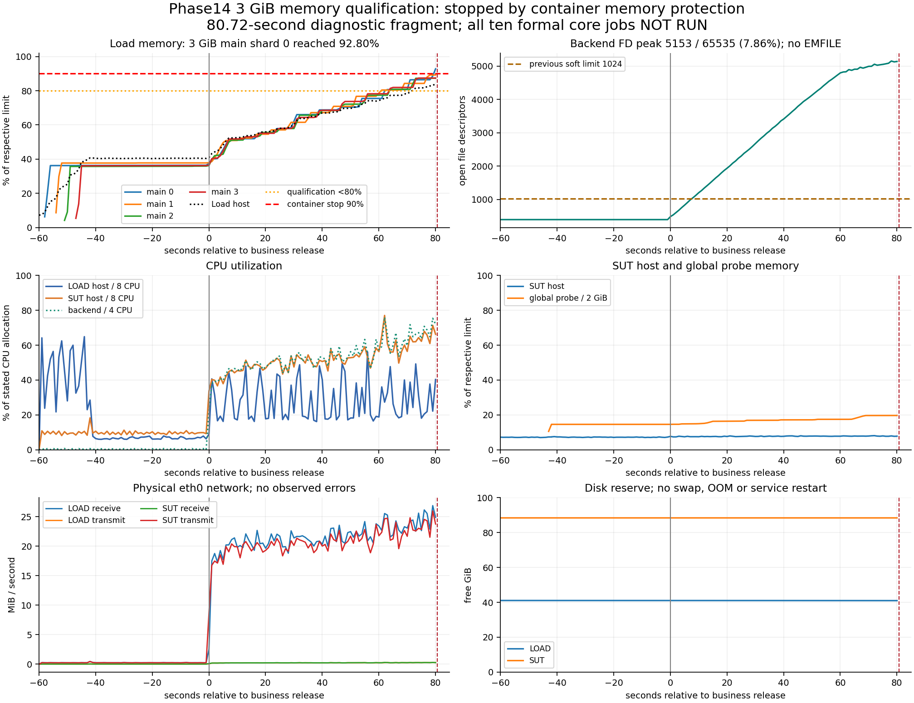

# Phase14 核心正式矩阵：3 GiB 内存资格结果

本轮唯一一次内存资格检查失败，十项核心正式场景全部未运行。四个主分片的 3 GiB（每 GiB 为 2³⁰ 字节）上限确实生效，但主分片 0 达到 92.80%，触发原有 90% 停止保护。当前压力发生器仍不具备继续正式测试的资格，因此不能据此评价被测服务器的万人容量。

## 修改与测量基线

测量提交为 `90af2fd82c54bf048163d8012e15942bc340668d`，目录树为 `6bb75918d4b2efbdbadeda7f85702caa617e17a4`。测量前控制端、Load（压力发生服务器）、SUT（被测服务器）与控制端新鲜读取的官方 main 一致，工作区干净。SUT 通过严格 SSH（加密远程连接）传输、SHA-256（文件摘要）校验的 Git bundle（离线对象包）同步，未伪造其 origin/main；它不能独立访问 GitHub。

`phase14_memory.py` 增加仅针对四个主分片的内存覆盖、实际限额核验、一次性执行声明、完整观察窗口判断和恢复记录；双机采样器读取 cgroup（Linux 资源控制组）的原始内存、inactive_file（可回收非活跃文件页）、工作内存、限额及 OOM（内存不足终止）事件。运行器在业务释放前核验全部五个执行单元，并保留原安全停止逻辑。正式场景参数、CPU 配额、生产 backend/frontend、k6 业务脚本、SharedArray（共享数组）、身份数据、断言和支付模拟均未改变。

测量完成后，提交 `a4790113f1bf0e233091c26c8b2781956fb07cb8` 将等价设置写入 `performance/phase14/load-main-memory.json`，运行器读取该标准文件。它与实测覆盖文件的字节摘要同为 `3cae4dcc909951d764ec5434c9824dced574244b020bb876497c9878f5da427e`。四主分片保持 10000 个 VU（虚拟用户）总分配，全局探针保持 384 个 VU、2 GiB，四种探针各自的全局速率保持原值。没有再次提高内存、改变分片或进行第二次高负载尝试。

配置内容、渲染摘要、Docker 检查值和 cgroup 实际值见 [配置证据](phase14_memory_configuration.json)。其中渲染模型为原基础配置加内存覆盖；实际启动命令还保留原有源码副本挂载覆盖，原件在结果目录。

## 唯一一次短检查

Run ID（运行编号）为 `phase14-formal-run-20260912T023405Z-668bff`。名称中的 formal 表示使用正式输入，不表示正式容量结果。本检查预分配正式 U1 的 10000 主 VU，执行原第一档从 0 升向 2500 的前 120 秒观察计划，而不是 2500 用户稳态平台。原 U1 定义仍为 1740 秒，检查由外部边界停止；30 秒初始化期限及其后的中止保护间隔不变。五个执行单元均按期就绪，但内存保护提前结束了业务窗口，实际 HTTP（请求响应协议）片段仅 80.72 秒。

工作内存 = 原始内存 − inactive_file。以下是业务片段的实际峰值，并非正式场景峰值。

| 执行单元 | 检查及 cgroup 限额 | 工作内存峰值 GiB | 峰值占比 | 最后可用约 30 秒增长 |
| --- | ---: | ---: | ---: | ---: |
| 主 0 | 3221225472 字节 | 2.7840 | 92.80% | 15.71 个百分点 |
| 主 1 | 3221225472 字节 | 2.6764 | 89.21% | 12.29 个百分点 |
| 主 2 | 3221225472 字节 | 2.6194 | 87.31% | 14.76 个百分点 |
| 主 3 | 3221225472 字节 | 2.6224 | 87.41% | 13.41 个百分点 |
| 全局探针 | 2147483648 字节 | 0.3936 | 19.68% | 不适用主分片门槛 |

四主分片均超过 80% 资格线；Load 主机内存最高 83.95%，最低可用约 2.36 GiB，也未满足低于 80% 的资格要求。计划中的最后 30 秒，即业务第 90 至 120 秒，没有被观察到，其趋势结果保持空值。表中的增长是停止前最后可用片段的只读诊断，用两端各约五秒均值比较，不能替代缺失的资格窗口。曲线持续上升且未观察到平台，但不能据此证明稳定工作集超过 3 GiB，也不能直接认定内存泄漏。

Load/SUT CPU 峰值分别为 56.10%/77.04%，SUT 内存峰值为 8.12%。未发现交换增长、OOM、容器重启、网络错误或磁盘耗尽。SUT 的 FD（文件描述符）软硬限额仍为 65535/65535，峰值 5153，占 7.86%，未发现 EMFILE（文件描述符耗尽）。Load/SUT 磁盘最低空闲约 40.98/88.40 GiB。

## 请求片段与数据核验

仅有 1681 名主用户实际进入片段；这个数字不是容量上限。记录到 22206 次 HTTP 请求，其中主业务 20068 次、探针 2138 次。片段总体 RPS（每秒请求数）为 275.11，主业务为 248.63。总体 P50/P95/P99（第 50/95/99 百分位延迟）分别为 2.84/52.67/69.20 毫秒，主业务为 2.75/53.65/69.76 毫秒。以上是中断片段诊断，正式吞吐量及正式业务失败率均为空值。

响应状态为 200 共 21257 次、201 共 787 次、202 共 162 次；已记录分类未出现系统错误或非预期错误，dropped iterations（未能按计划启动的迭代）为零。但是主业务有 1681 个迭代被中断，支付有 9 个被中断，不能将已记录的 2xx 等同于完整业务成功率 100%。

原始业务对账明确保留失败：支付数据库有 162 笔已支付记录，负载端只有 153 个完整终态，其余 9 个流程被停止打断，产生 `payment terminal reconciliation failed`。14 项数据库全局不变量均为零，主业务订单/用户/预订各 219，错误座位与身份归属不匹配为零；没有观察到超卖或状态破坏。这个结果不能代替未执行的热点竞争对账。

随后按原流程恢复数据库和 Redis（内存键值数据库）。恢复后的数据库指纹与已知基线及关机前最终指纹完全一致：`31baa298d90a8df76133ad1833e3475f79c08cf992b91cdeddbaa44f7b52cf16`；Redis 键数为零，最终全局不变量通过。

PostgreSQL（关系数据库）采样增量为 41821 次提交、零回滚、零死锁；提交量包含监测和核验，不能当作业务每秒事务数。累计执行耗时最高三个查询编号为 -5628695834181976288、-455704000372811774、-3777772599989396074，分别调用 3098/1681/1681 次，累计 36.23/22.41/6.13 秒。Redis 峰值内存约 8.59 MiB、连接数 5、阻塞连接零、瞬时操作 809 次/秒；拒绝连接、驱逐和错误回复增量均为零。命中/未命中增量为 27138/15354904，批量读取未占座键会产生未命中，不能直接判定缓存失效。首个可证实的停止原因是 Load 内存；这段观测不足以确定后端、数据库或 Redis 的正式容量边界。

## 十项核心正式结果

| 项目 | 冻结规模 | 本轮结果 |
| --- | --- | --- |
| U1 第一轮 | 2500→5000→10000 在线用户，1740 秒 | 未运行 |
| U2 第一轮 | 185000 次独立刷新，1740 秒 | 未运行 |
| O1 第一档 | 10000 条完整订单链，60 秒 | 未运行 |
| O1 第二档 | 同上，30 秒 | 未运行 |
| O1 第三档 | 同上，10 秒 | 未运行 |
| H1 临时路径 | 10000 人竞争 1000 座 | 未运行 |
| H1 正式路径 | 10000 人竞争 1000 座 | 未运行 |
| H3 正式路径 | 10000 人竞争 1 座 | 未运行 |
| L2 背景对照 | 原冻结背景流量 | 未运行 |
| L2 登录洪峰 | 10 秒到达 10000 次登录及原背景流量 | 未运行 |

全部原因均为前置内存资格失败。U1/U2/O1 没有正式吞吐、延迟、错误率，H1/H3 没有正式成功/冲突/赢家守恒结果，L2 没有登录及背景流量结果。本轮也未执行原 24 项中已排除的 U1/U2 第二轮、J1、E1、H1 重复轮、H2、H3 临时路径、L1、S1；没有宣称完成原完整矩阵。

## 三阶段对照与验证范围

| 阶段 | 测量提交 | 实际片段 | 进入主用户 | 结论 |
| --- | --- | ---: | ---: | --- |
| 原 FD 1024 | 9006ee822e557255e244364495fbe251a1a25b18 | 约 8 秒 | 178 | 正式 U1 测量无效，FD 耗尽 |
| FD 修复、主分片 2 GiB | a169350b5ec61a6f9f077a80e7af7bfeca92d239 | 28.68 秒 | 597 | 正式 U1 测量无效，Load 内存保护 |
| 本轮主分片 3 GiB | 90af2fd82c54bf048163d8012e15942bc340668d | 80.72 秒 | 1681 | 短内存资格失败，无正式场景 |

前两轮报告和原始证据均保留，未被本报告覆盖。旧 2 GiB 分析读取保留的 Docker Engine（容器引擎）内存统计；已退出容器的 cgroup 目录不可读取，未将缓存伪装成现场读取。

按本轮授权复用两次冷初始化、延迟分片故障测试、G0 ABBA（负载机校准及采样开销交叉对照）、完整 Smoke（冒烟测试）25/25、207 项原测试、FD 定向测试及连接资格。没有重跑，也没有刷新旧资格日期。逐文件摘要、原提交和原目录见结构化结果的 `baselineReferences.originalEvidence`。

本轮新增内存实现定向测试在 Windows/Linux 各 5 项通过；标准配置写回后相应测试各 6 项通过。Linux Compose（容器编排配置）渲染验证只改变主分片内存，CPU 和探针保持原值。交付另增 3 项跨文件报告契约测试，覆盖失败分类、真实限额、恢复与证据关联，Windows 三项通过。最终 Linux 报告测试未能启动：双机管理 SSH 均在密钥交换前关闭连接，返回 `kex_exchange_identification: Connection closed by remote host`。有限诊断记录已保存；这不是负载重试，也不能标记 Linux 报告测试通过。提交前执行 `git diff --check`；不重复原 207 项全量测试。

该连接问题发生在服务停止和凭据清理完成之后。测量时三端一致已核验，但最终配置和报告向双机同步及收尾后的再次远程核验受阻；服务器最后已核验提交仍为 `90af2fd`。不能把控制端最终提交状态冒充服务器已同步。尚需管理连接恢复后补做三项 Linux 报告测试、只读状态检查和正常快进同步，无须启动 Phase14 服务。

## 证据与收尾

服务运行时间为北京时间 2026-09-12 10:33:02 至 10:45:52，共 769.94 秒，约 12 分 50 秒。没有因等待耗满四小时，也没有第二次尝试。

新部署目录：`/srv/phase14/repo/performance/results/phase14-formal-memory-deploy-20260912T023255Z-8aa4cd`。唯一检查目录使用上述 Run ID；启动记录为 `phase14-formal-memory-launch-20260912T023405Z-e2487c`，关机记录为 `phase14-formal-memory-shutdown-20260912T024530Z-6a89d9`，均位于同一 results 根目录。

原始日志、k6 压缩指标、双机逐秒采样、初始化记录、运行清单、配置渲染、数据库对账、恢复和清理记录保留在服务器及本地 `performance/results/phase14-memory-analysis/round/`，不进入 Git。归集档案含 191 个文件，4514988 字节，SHA-256 为 `674533d4280c60a29a17d9e34908e89a8a0a97a4bba8b10f37160bdf781857d5`。报告、[结构化结果](phase14_memory_results.json)、配置证据、图表、工具与测试进入 Git。

Load 与 SUT 的 Phase14 专属运行容器均为零，保留镜像、数据卷和全部历史证据。SUT 对应临时公钥授权已撤销，Load 专用私钥、公钥、主机记录及配置段已删除，撤销后的认证失败检查通过。控制端原有管理连接不受影响。

停止容器不等于停止 ECS（云服务器）计费；请按实例购买方式自行停止或释放云服务器。本轮只能证明 3 GiB 配置及 FD 修复实际生效、发生器仍未通过内存资格、保护与恢复完成，不能证明系统通过或未通过万人在线、开放请求、订单写入、热点抢座或登录洪峰容量。
